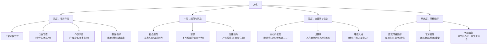
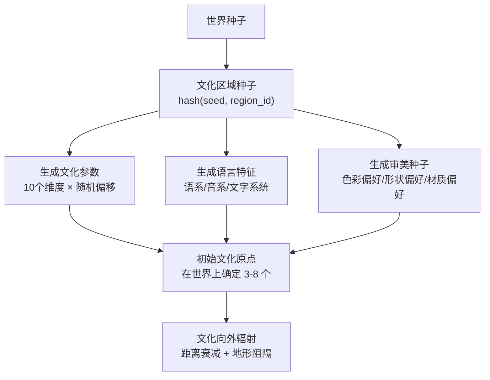
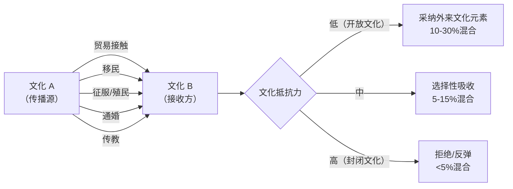

# 文化系统设计

> **创建 2026-06-02**：系统化文化设计——从起源到演变  
> 关联：[[文化 信仰 国体混合起源种子]]、[[总设计草稿]] §4.6 文化系统三层、[[建筑风格]]

---

## 一、什么是"文化"

在 WoWorld 中，**文化**是一个聚落或政治实体的集体行为模式、价值观、审美偏好和社会规范的集合。文化不是"种族特性"——同一文化下可以有多个种族；同一种族也可以分属不同文化。

文化是一个**涌现系统**：它从世界种子产生初始参数，在游戏运行中受 NPC 集体行为影响而缓慢演变。

---

## 二、文化的构成要素

### 2.1 文化 = 各要素的组合



### 2.2 文化参数的数字化

每个文化由一组数值参数定义（0-1 范围内）：

| 参数 | 说明 | 低值 | 高值 |
|------|------|------|------|
| `individualism` | 个人主义 vs 集体主义 | 集体优先 | 个人优先 |
| `power_distance` | 权力距离（对等级制度的接受度） | 平等主义 | 严格的等级 |
| `uncertainty_avoidance` | 不确定性规避 | 包容变化、灵活 | 崇尚传统、规避风险 |
| `masculinity` | 刚性 vs 柔性（竞争 vs 关怀） | 合作、关怀主导 | 竞争、成就主导 |
| `long_term_orientation` | 长期取向 | 活在当下 | 长远规划 |
| `indulgence` | 放纵 vs 克制 | 克制欲望 | 享受生活 |
| `openness_to_outsiders` | 对外来者的开放度 | 排外/怀疑 | 开放/好奇 |
| `religiosity` | 宗教性（世俗 vs 宗教） | 世俗化 | 宗教渗透一切 |
| `militarism` | 军事化程度 | 和平主义 | 军事优先 |
| `artistry` | 艺术与审美重视度 | 功能优先 | 美感优先 |

---

## 三、文化如何生成

### 3.1 起源：从种子到文化



### 3.2 文化区域的划分

世界生成时确定**文化区域**——具有相似文化特征的连续地理空间：

| 文化区域规模 | 覆盖范围 | 包含聚落数（预估） |
|-------------|---------|-------------------|
| 大型文化区 | 覆盖数个聚落群域 | 30-100+ |
| 中型文化区 | 覆盖 1 个聚落群域 | 10-30 |
| 小型文化区 | 覆盖 1 个城市及周边 | 3-10 |
| 微型文化区 | 单个孤立聚落 | 1-3 |

一个[[聚落群域]]通常属于同一个文化区域，但边界处可能存在文化混合。

### 3.3 文化边界的处理

- **清晰边界**（山脉、大河、沙漠阻隔）：两种文化截然不同
- **模糊边界**（平原连续区域）：文化渐变过渡带，混合比例为 70/30 → 50/50 → 30/70
- **文化飞地**：因移民/征服而在异文化区中出现的孤立同文化聚落

---

## 四、文化如何影响世界

### 4.1 建筑与聚落外观

文化参数 → [[建筑风格]]的映射：

| 文化参数 | 建筑影响 |
|----------|---------|
| `power_distance` 高 | 建筑有明显的等级象征（行政中心极宏伟，民居简朴） |
| `uncertainty_avoidance` 高 | 建筑风格统一、传统、变化少 |
| `individualism` 高 | 建筑个性化程度高，民居之间差异大 |
| `artistry` 高 | 装饰丰富（雕刻、彩绘、马赛克） |
| `long_term_orientation` 高 | 建筑质量好，使用耐久材料 |
| 地域材料 | 就地取材决定建筑的色调和质感（见[[06-体素设计决策]] §2.2） |

### 4.2 服装与外观

| 文化偏好 | 表现 |
|----------|------|
| 暖色调 vs 冷色调 | 服装、旗帜、建筑涂装的色彩倾向 |
| 遮盖度（高/中/低） | 服装覆盖身体的比例（受气候+文化双重影响） |
| 装饰倾向 | 倾向于几何图案 vs 自然图案 vs 文字装饰 |
| 材质偏好 | 偏好光泽（丝绸/金属）vs 哑光（棉麻/皮革） |

### 4.3 饮食文化

- **主食类型**：小麦面包 vs 大米 vs 玉米 vs 薯类 — 取决于当地农业条件
- **肉食文化**：哪些动物可以吃、哪些是禁忌
- **饮酒文化**：是否饮酒、饮什么酒、饮酒的社交礼仪
- **共食 vs 分食**：是一起分享大盘菜还是每人独立一份

### 4.4 社会结构

| 文化倾向 | 表现 |
|----------|------|
| 高权力距离 | 贵族/平民/奴隶的分明等级制度 |
| 低权力距离 | 相对平等的社会，阶层流动可能 |
| 高集体主义 | 家族/氏族为社会基本单位 |
| 高个人主义 | 核心家庭或个人的独立性更强 |

---

## 五、文化的动态演变

### 5.1 文化的三层演变速度

```
表层（行为习俗）：变化快 —— 每游戏月更新
中层（规范禁忌）：变化中 —— 每游戏年微调
深层（价值观）：变化慢 —— 代际漂移（游戏中数十年）
审美层（风格偏好）：变化中 —— 受接触其他文化影响
```

### 5.2 文化传播机制



### 5.3 文化分化与融合

- **文化分化**：一个文化区域因政治分裂/地理隔离，经过足够时间后分化为两个有差异的子文化
- **文化融合**：两种文化长期接触后，在交界处形成新的混合文化（克里奥尔化）
- **文化消亡**：当一种文化的所有载体（聚落/NPC）消失时，该文化消亡

### 5.4 玩家对文化的影响

玩家作为外来者，可以：
- 引入外来文化元素（通过贸易/建筑/行为示范）
- 加速文化传播（作为跨文化区域的旅行者）
- 成为文化英雄/传奇（玩家的重大行为可能被写入文化叙事）

---

## 六、文化与[[NPC信仰系统|信仰]]的关系

文化和信仰在许多社会中紧密交织，但它们是不同层面的概念：

| | 文化 | 信仰 |
|------|------|------|
| **定义** | 集体行为模式和价值观 | 对超自然存在的信念和崇拜方式 |
| **强制性** | 社会舆论/习惯（软约束） | 教义/戒律（可能硬约束） |
| **变化速度** | 较快（世代可见） | 较慢（经典固定） |
| **一个聚落可以** | 只有一个主流文化 | 有多种信仰共存 |

文化参数中的 `religiosity` 决定了信仰在该文化中的渗透程度。高宗教性的文化中，信仰渗透到日常生活、法律、艺术的方方面面。

---

## 七、文化与[[聚落群域|政治实体]]

### 7.1 文化 = 政治合法性的来源之一

- 许多政体的统治合法性部分来自文化传统（"自古以来就是XX族/XX教的土地"）
- 征服不同文化的领土后，统治者面临文化整合的挑战
- 文化统一的区域更容易形成稳定的政治实体

### 7.2 文化的政治化

- **民族主义型**：文化 = 政治实体的核心凝聚力。"我们是XX人"既是文化认同也是政治认同。
- **帝国型**：政治实体包含多种文化，统治文化与被统治文化之间有张力。
- **城邦型**：文化认同围绕单个城市展开。

---

## 八、开发阶段的实现节奏

| 阶段 | 实现内容 |
|------|---------|
| 阶段〇~一 | 文化参数的数据结构定义 |
| 阶段二 | 文化区域划分 + 初始文化参数生成 + 建筑风格映射 |
| 阶段三 | 文化传播/分化的动态系统 |
| 阶段五 | 文化对 NPC 叙事和事件的影响 |
| 阶段七 | 完整的文化演变模拟 |

---

## 九、关联文档

| 文档 | 关联内容 |
|------|---------|
| [[文化 信仰 国体混合起源种子]] | 文化、信仰、政体的联合起源种子 |
| [[NPC信仰系统]] | NPC 的信仰体系设计 |
| [[建筑风格]] | 文化如何决定建筑外观 |
| [[聚落群域]] | 政治实体的文化与国教 |
| [[总设计草稿]] | §4.6 文化系统三层 |
| [[道德]] | 文化与道德共识 |
| [[仪式]] | 文化决定的仪式和节日 |
| [[06-体素设计决策]] | §2.2 建筑材质与文化关联 |
