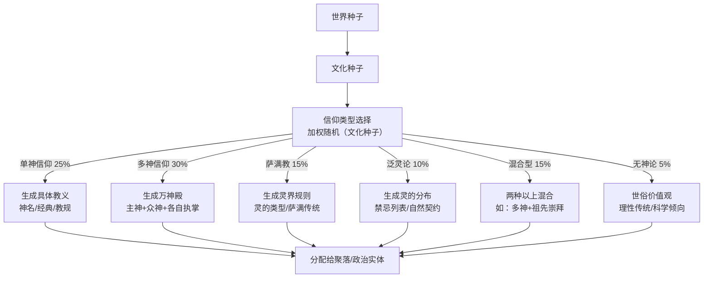

# NPC 信仰系统设计

> **创建 2026-06-02**：为 NPC 构建完整的信仰体系——从单神到无神论  
> 关联：[[神明]]、[[文化 信仰 国体混合起源种子]]、[[总设计草稿]] §4.6 文化系统三层

---

## 一、概述

NPC 的信仰系统是驱动其价值观、行为习俗和社会归属感的核心模块之一。信仰不只是"信哪个神"——它包含世界观、道德根基、仪式习惯和群体认同。

信仰与[[文化 信仰 国体混合起源种子|文化]]紧密交织但不等同于文化。两个共享同一文化的聚落可能信仰不同；两个信仰相同的聚落可能文化迥异。

---

## 二、信仰类型

### 2.1 单神信仰（Monotheism）

**核心信念**：存在唯一的神。此神全知全能，是世界和道德的终极来源。

| 子类型 | 特征 | 典型表现 |
|--------|------|---------|
| **创世独神** | 神创造了世界但此后不再直接干预 | 通过经典/先知了解神意，强调个人修行 |
| **干预独神** | 神持续关注和干预世界 | 祈祷、神迹、天启频繁出现在信仰叙事中 |
| **二元独神** | 善神与恶神的永恒对立 | 世界是善与恶的战场，信徒需选择阵营 |
| **泛神倾向独神** | 神即宇宙本身，万物是神的一部分 | 冥想、与自然合一的神秘主义倾向 |

**游戏中的表现**：
- 信徒定期去[[神殿/教堂]]参加仪式
- 神职人员（牧师/祭司）在社会中享有特殊地位
- 道德规范从宗教经典派生，违反=亵渎
- 对不同信仰者的态度：从"需要被拯救的迷途者"到"必须被清除的异教徒"

### 2.2 多神信仰（Polytheism）

**核心信念**：存在多个神明，各有执掌领域。信徒根据需要向不同的神祈祷。

| 子类型 | 特征 | 典型表现 |
|--------|------|---------|
| **万神殿型** | 明确的神祇谱系和等级（主神+众神） | 类似希腊/北欧神话：众神各有性格和故事 |
| **职能分工型** | 每个神掌管一个具体领域（农业、战争、爱情……） | 农民拜农神、铁匠拜火神、战士拜战神 |
| **地域守护型** | 每个地区/城市/家族有自己的守护神 | 地方信仰浓厚，出门在外需拜当地神 |
| **自然力量型** | 神即自然力量的人格化（风神、河神、山神） | 泛灵倾向，每一个显著的自然景观都有神灵 |

**游戏中的表现**：
- 不同职业/身份的 NPC 主要崇拜与其相关的神
- 万神殿中的神祇之间也有冲突，波及信徒
- 地域守护神信仰加强了聚落的本地认同
- 神殿可能供奉多个神，或每个神有独立的神殿
- NPC 在特定情境下（出海前拜海神、开战前拜战神）进行针对性祈祷

### 2.3 萨满教（Shamanism）

**核心信念**：世界分为多个层界（天界、人间、灵界），萨满是能够穿梭层界与灵沟通的人。

| 特征 | 说明 |
|------|------|
| **万物有灵底色** | 动物、植物、岩石、河流都有灵性 |
| **灵界旅程** | 萨满通过击鼓、舞蹈、药草进入"出神"状态，前往灵界 |
| **祖灵崇拜** | 祖先的灵魂持续影响活人的世界，需要定期祭祀 |
| **没有固定经典** | 知识通过口传和直接体验传承，每个萨满的体验可能不同 |
| **治疗与占卜** | 萨满的核心社会功能是治病、预言、寻找失物 |

**游戏中的表现**：
- 萨满作为 NPC 职业存在，有特殊的"灵界旅行"行为模式
- 萨满社区的聚落通常较小型、接近自然
- 动物 NPC（如狼、熊）在萨满文化区域可能有不同的交互逻辑
- 萨满可能通过"灵视"发现隐藏的信息（如矿脉、敌人的位置）

### 2.4 泛灵论（Animism）

**核心信念**：万物皆有灵——不只是生物，岩石、河流、风、火都有意识和意志。

| 特征 | 说明 |
|------|------|
| **无中心神祇** | 没有至高神，每个"灵"在各自的领域独立存在 |
| **灵与灵的平等** | 人的灵与其他万物的灵是平等的——人类不是特殊的 |
| **互惠关系** | 人类与自然之灵维持互惠关系：取之有度、用之有礼 |
| **禁忌系统** | 泛灵信仰通常伴随着复杂的禁忌（如不能砍某棵树、不能在特定日子打猎） |

**游戏中的表现**：
- NPC 的行为受禁忌约束（如不在特定区域采集资源）
- 破坏自然环境可能触怒当地之灵，影响 NPC 与玩家的关系
- 泛灵论社区的自然资源管理通常更可持续
- 建筑方式和材料选择受到"灵"的许可限制

### 2.5 祖先崇拜（Ancestor Worship）

**核心信念**：祖先的灵魂继续存在，并对后代的生活产生直接影响。

| 特征 | 说明 |
|------|------|
| **可以独立存在或与其他信仰混合** | 单神信仰者可能也祭拜祖先 |
| **家族为核心单位** | 祖先崇拜通常以家族/氏族为单位进行 |
| **定期祭祀** | 特定日期或家族事件（婚丧嫁娶）时祭拜 |
| **祖训即道德** | "祖先的规矩"就是最高的行为准则 |

### 2.6 无神论 / 不可知论（Atheism / Agnosticism）

**核心信念**：不相信神的存在（无神论）或认为神的存在不可知（不可知论）。

| 子类型 | 特征 |
|--------|------|
| **理性无神论** | 基于理性思考得出结论：神不存在。道德来自人类社会而非神启。 |
| **漠然不可知论** | "神存不存在与我无关"。不参与宗教活动，但也不反对他人信仰。 |
| **反神论** | 不仅自己不信，而且认为宗教对社会有害。可能主动批判宗教机构。 |
| **实用世俗主义** | 不讨论神的问题，只关注现世的事务（科学、经济、政治）。 |

**游戏中的表现**：
- 无神论 NPC 不受宗教规范和禁忌约束
- 可能因此与宗教社区的 NPC 产生摩擦
- 在神权政体中，公开的无神论者可能面临法律/社会制裁
- 无神论 NPC 更倾向于接受"理性"和"科学"的解释

### 2.7 奇幻世界特有的信仰类型

| 类型 | 特征 |
|------|------|
| **登神信仰** | 相信凡人可以通过特定途径（伟大功绩、魔法仪式、神之试炼）升格为神。崇拜的对象是"曾经是人"的神。 |
| **龙神信仰** | 龙被视为神或神的化身。不同颜色的龙可能代表不同的神格面向。 |
| **魔法即神** | 魔法本身被视为神圣力量。不崇拜人格化的神，而是崇拜魔力本身。 |
| **元素信仰** | 以[[元素|10元素]]（金木水火土风雷电血灵）为崇拜对象。每种元素有其祭司和仪式。 |
| **世界机信仰** | 相信世界本身是一台巨大的机械（世界机），被某个未知的存在或法则驱动。 |

---

## 三、信仰的生成与分配

### 3.1 信仰从何而来



### 3.2 信仰分配规则

| 规则 | 说明 |
|------|------|
| **一个政治实体可以有国教** | 官方推行的信仰，享受政策和税收优惠 |
| **一个聚落可以有主流信仰** | 大多数居民（60-90%）信仰同一宗教 |
| **少数信仰共存** | 聚落中可能有 10-40% 的少数信仰者 |
| **大城市信仰最多元** | 城市有来自各地的移民，信仰种类最多 |
| **偏远村庄信仰最单一** | 人口流动少，通常全村信仰一致 |
| **边境区域信仰混合** | 两个信仰区域的交界处自然形成混合 |

### 3.3 NPC 个体信仰

每个 NPC 在生成时被分配一个信仰归属，同时还有一个 **虔诚度（Piety）** 属性：

| 虔诚度 | 值 | 表现 |
|--------|-----|------|
| **狂热** | 0.9-1.0 | 每天祈祷多次，严格遵循教规，可能主动传教或迫害异教徒 |
| **虔诚** | 0.7-0.9 | 定期参加仪式，教规是行为的重要参考 |
| **普通** | 0.4-0.7 | 参加主要节日的仪式，教规偶尔被考虑 |
| **冷淡** | 0.1-0.4 | 名义上属于该信仰，几乎不参与宗教活动 |
| **无信仰** | 0.0 | 无宗教信仰，或虽名义上归属某教但完全不在意 |

---

## 四、信仰对 NPC 行为的影响

### 4.1 日常行为

| 信仰类型 | 日常行为影响 |
|----------|-------------|
| 单神信仰 | 定期去神殿祈祷、恪守特定的饮食禁忌、以教义为行为准则 |
| 多神信仰 | 按情境向不同神祈祷、参加不同神的节日 |
| 萨满教 | 定期举行萨满仪式、遇到困难时咨询萨满 |
| 泛灵论 | 采集/狩猎前进行灵的许可仪式、严格遵守禁忌 |
| 祖先崇拜 | 定期祭拜祖先、重要决定前"请示"祖先 |
| 无神论 | 无宗教行为，可能更多参与世俗文化活动 |

### 4.2 社交行为

- **同信仰者之间**：初始好感度加成、更容易建立信任关系
- **不同信仰者之间**：取决于信仰间的宽容度
  - 高宽容度：和平共处，可能互相好奇
  - 低宽容度：疏远、歧视、可能产生冲突
- **改变信仰**：重大生活事件（结婚、迁移、神迹见证）可能导致 NPC 改变信仰

### 4.3 与社会系统的互动

| 系统 | 信仰的影响 |
|------|-----------|
| [[道德]]共识 | 信仰是道德共识的重要来源（但非唯一来源） |
| 法律 | 神权政体的法律直接从教义派生 |
| [[聚落群域\|政治实体]] | 国教影响外交（同教友好、异教警惕） |
| [[经济]] | 神殿/教会拥有土地和财富；宗教节日刺激经济活动 |
| [[仪式]] | 大多数仪式的形式和内容由信仰决定 |
| [[想法/WoW World/战斗]] | 信仰影响战斗意志（"为神而战"的狂热加成） |

---

## 五、信仰的动态变化

### 5.1 信仰传播

- 贸易路线是信仰传播的主要渠道
- 征服/殖民可能导致被征服地区的信仰被强制改变
- 传教士 NPC 会主动在异教区域传播信仰
- 神迹事件（如某神显灵）可能吸引大量新信徒

### 5.2 信仰演变

- 随着时间推移，信仰的教义可能发生细微变化（代际漂移）
- 大分裂：一个信仰可能因神学分歧分裂为两个或多个教派
- 融合：长期接触的两种信仰可能融合出新的混合信仰
- 消亡：信徒过少的信仰可能随时间消亡

### 5.3 与[[神明]]系统的关系

游戏世界中存在真实的[[神明]]（见[[神明]]文档）。信仰是 NPC 对这些神明的主观认知和崇拜方式，而神明本身（如果确实存在）可能在游戏中以某种方式显现——这取决于游戏最终的叙事设计。

```
神明（客观存在 or 信仰建构？）
  ↕
信仰（NPC 对神的主观认知+崇拜方式）
  ↕
宗教机构（神殿/教会/萨满传统）
  ↕
信徒行为（日常仪式/禁忌/节日/朝圣）
```

---

## 六、关联文档

| 文档 | 关联内容 |
|------|---------|
| [[神明]] | 神明的分类（预设神/后天登神/概念神/形体神等） |
| [[文化 信仰 国体混合起源种子]] | 信仰、文化、政体的起源种子 |
| [[总设计草稿]] | §4.6 文化系统三层、§7.5 仪式与节日 |
| [[道德]] | 道德共识与信仰的关系 |
| [[仪式]] | 宗教仪式的形式和内容 |
| [[魔法]] | 魔法与宗教的关系（魔法是神的恩赐 vs 魔法是独立力量） |
| [[元素]] | 元素信仰体系 |
| [[聚落群域]] | 政治实体与国教 |
