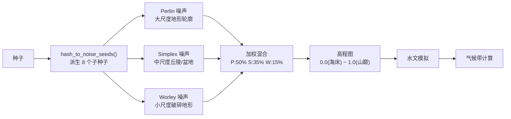
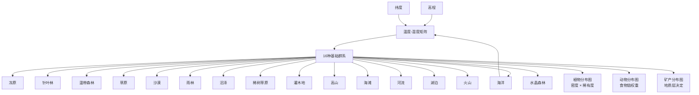
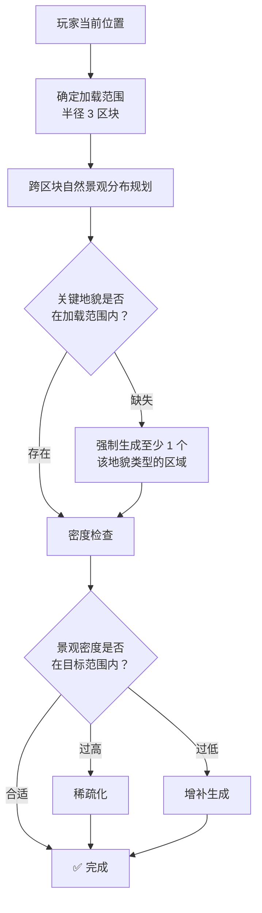
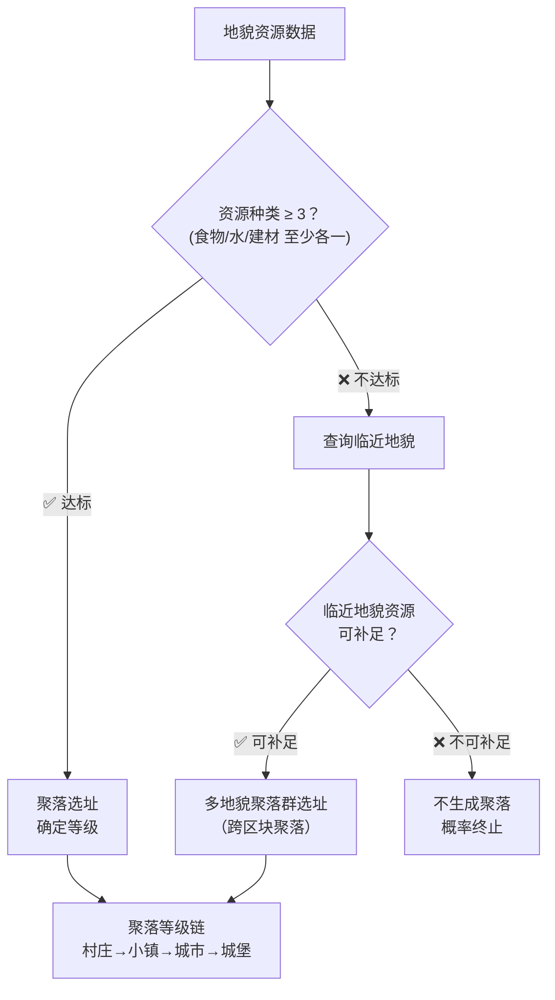
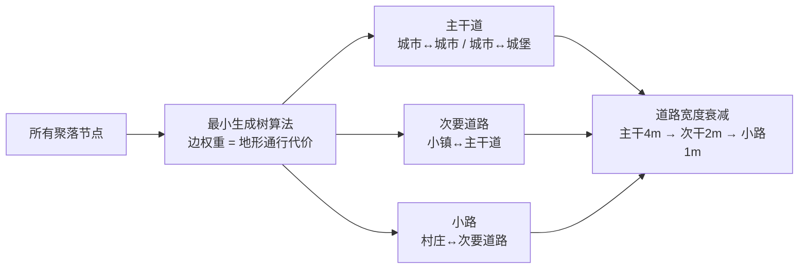
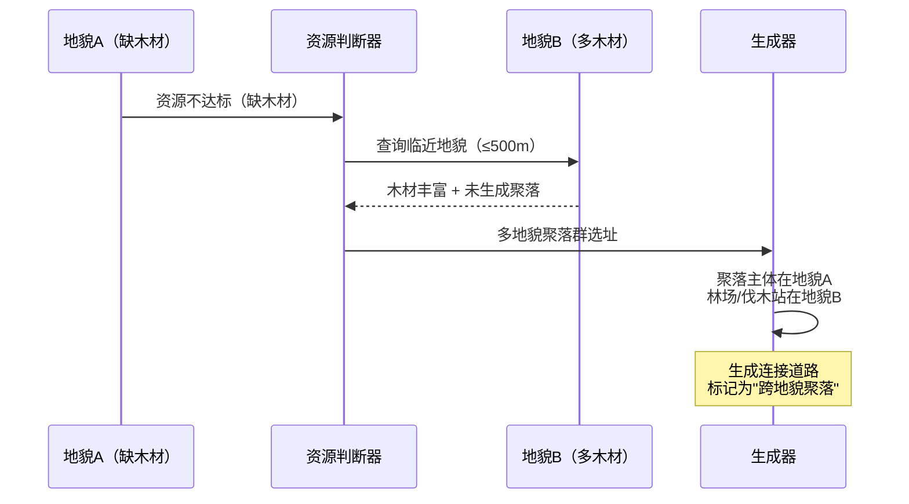
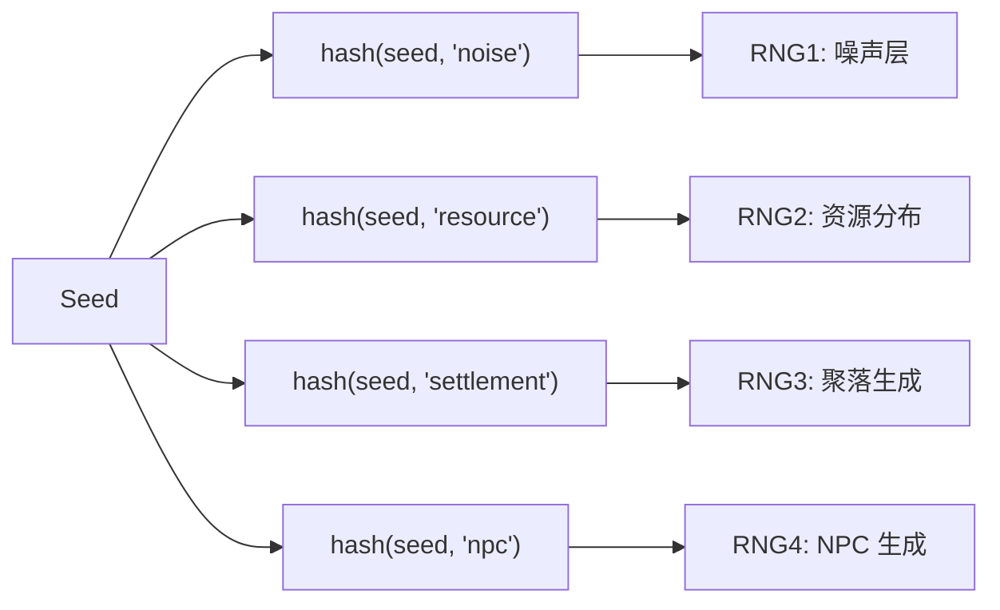

# 世界生成总流程

> 来源：`世界地形建筑生成规则ver0.5` + `ver0.6` Canvas  
> 状态：详细设计  
> 对应：`总设计草稿.md` §3 世界系统

---

## 一、总览

世界生成是从一个 `uint64` 种子出发，经过 10 个阶段逐级细化的确定性管线。同一种子永远生成同一个世界。

```mermaid
flowchart TD
    S[/"🌱 世界种子\nuint64"/] --> P1

    subgraph P1["阶段一：自然基底"]
        A1["噪声层叠加\nPerlin × Simplex × Worley"]
        A2["高程图生成\n海平面/山脉/河谷"]
        A3["水文模拟\n河流侵蚀 + 湖泊填注"]
        A4["气候带划分\n纬度 + 洋流 + 雨影"]
    end

    P1 --> P2

    subgraph P2["阶段二：生物群落"]
        B1["温度-湿度矩阵\n→ 16种基础生物群系"]
        B2["动植物分布\n密度图 + 稀有度权重"]
        B3["资源矿脉生成\n金属/宝石/魔法材料"]
    end

    P2 --> P3

    subgraph P3["阶段三：自然景观布局"]
        C1["围绕玩家加载区块\n跨区块自然景观分布规划"]
        C2["各地貌资源规划\n食物/木材/矿产/水源"]
        C3["特殊自然景观\n奇观/圣地/危险区"]
    end

    P3 --> P4

    subgraph P4["阶段四：聚落选址"]
        D1["资源种类数量判断\n阈值: ≥3种达标"]
        D2["聚落选址 + 等级确定"]
        D3["独立建筑选址\n非聚落单体建筑"]
        D4["跨地貌补足判断\n临近地貌资源互补"]
    end

    P4 --> P5

    subgraph P5["阶段五：聚落内部布局"]
        E1["政体/文化确认\n影响建筑布局逻辑"]
        E2["地形修正\n平地不足时创造平地"]
        E3["功能分区\n行政/居住/生产/宗教/军事"]
        E4["城防体系\n城墙/壕沟/哨塔"]
    end

    P5 --> P6

    subgraph P6["阶段六：建筑生成"]
        F1["建筑文化类型确定\n屋顶/材料/装饰风格"]
        F2["建筑核心功能确定\n模板 vs 个性化"]
        F3["楼层/房间布局生成"]
        F4["内饰与外装修"]
    end

    P6 --> P7

    subgraph P7["阶段七：交通网络"]
        G1["聚落间道路规划\n最小生成树 + 地形代价"]
        G2["道路等级\n土路/石路/驿道"]
    end

    P7 --> P8

    subgraph P8["阶段八：NPC 初始化"]
        H1["按聚落分配人口\n城市>小镇>村庄"]
        H2["NPC 属性生成\n身份/性格/技能/关系"]
        H3["初始经济状态\n库存/价格/货币总量"]
    end

    P8 --> P9

    subgraph P9["阶段九：历史模拟"]
        I1["快进 N 年游戏时间\n让世界'老化'"]
        I2["聚落兴衰/建筑损毁\n关系网络演变"]
    end

    P9 --> OUT[/"✅ 可游玩世界"/]

    style S fill:#2d5a27,stroke:#4a9,color:#fff
    style OUT fill:#2d5a27,stroke:#4a9,color:#fff
    style P1 fill:#1a1a2e,stroke:#e94560
    style P2 fill:#1a1a2e,stroke:#0f3460
    style P3 fill:#1a1a2e,stroke:#16213e
    style P4 fill:#1a1a2e,stroke:#533483
    style P5 fill:#1a1a2e,stroke:#e94560
    style P6 fill:#1a1a2e,stroke:#0f3460
    style P7 fill:#1a1a2e,stroke:#16213e
    style P8 fill:#1a1a2e,stroke:#533483
    style P9 fill:#1a1a2e,stroke:#e94560
```



---

## 二、各阶段详细设计

### 阶段一：自然基底

**输入**：`uint64` 世界种子  
**输出**：高程图、水文图、气候图（均为 2D 数组）



**关键参数**：

| 参数 | 默认值 | 说明 |
|------|--------|------|
| `sea_level` | 0.35 | 海平面阈值，低于此值为水域 |
| `mountain_threshold` | 0.72 | 山脉阈值 |
| `river_density` | 0.003 | 河流起始点密度 |
| `lake_probability` | 0.01 | 湖泊生成概率 |

**水文模拟算法**：
1. 在高程 > 0.6 的区域随机撒河流种子点
2. 从每个种子点沿坡度最陡方向下流
3. 流量累积：支流汇入处增大河流宽度
4. 局部低洼处形成湖泊
5. 河流最终汇入海洋

---

### 阶段二：生物群落



**资源分布规则**：

| 资源类型 | 决定因素 | 示例 |
|----------|---------|------|
| 食物 | 生物群系 + 水源距离 | 河流旁农田肥沃 |
| 木材 | 森林密度 | 针叶林 > 雨林 > 草原 |
| 石材 | 高程 + 地质 | 山区多花岗岩 |
| 金属矿 | 地质层（Perlin） | 铁矿浅层，金矿深层 |
| 魔法材料 | 特殊群系 + 低概率 | 水晶森林产魔力水晶 |
| 水源 | 河流/湖泊距离 | 聚落必需 ≤ 200m |

---

### 阶段三：自然景观布局

**核心概念**：围绕玩家加载范围进行跨区块自然景观分布规划。这是 Canvas `ver0.5` 的独特设计——世界生成不是全域均匀的，而是围绕玩家活动范围进行密度控制。



**每种地貌的资源规划**（对应 Canvas 中的 `各地貌资源规划` 节点）：

每个地貌区块确定后，单独计算其内部资源分布：
- 食物产出能力（kcal/年）
- 木材储量（吨）
- 矿产种类与储量
- 水资源容量（升/秒）
- 可建造面积（m²）

这些数值决定后续聚落能否在此选址。

---

### 阶段四：聚落选址

详见 [`02-聚落生成规则.md`](./02-聚落生成规则.md)

简版流程：



**资源种类达标判断**（`聚落生成地貌资源判断`）：

| 必要条件 | 最低阈值 |
|----------|---------|
| 淡水源 | 河流/湖泊 ≤ 200m 或地下水 |
| 食物来源 | 可耕地/狩猎区/渔场 |
| 建筑材料 | 木材或石材 |

三项全部满足 → 达标。缺一项 → 检查临近地貌（≤ 500m）是否可补足。

---

### 阶段五：聚落内部布局

详见 [`02-聚落生成规则.md`](./02-聚落生成规则.md)

### 阶段六：建筑生成

详见 [`03-建筑生成规则.md`](./03-建筑生成规则.md)

### 阶段七：交通网络



**地形通行代价**：

| 地形 | 代价系数 |
|------|---------|
| 平原 | 1.0 |
| 丘陵 | 1.5 |
| 森林 | 2.0 |
| 沼泽 | 4.0 |
| 山脉 | 10.0 |
| 水域 | 不可通行（除非有桥） |

### 阶段八：NPC 初始化

详见 [`05-NPC认知模型.md`](./05-NPC认知模型.md) 和 `总设计草稿.md` §4 NPC 系统

### 阶段九：历史模拟

世界生成后不是"全新"的——快进 N 年游戏时间让世界产生历史痕迹：

- 聚落人口增长/衰减（基于资源承载力）
- 建筑老化/损毁/重建
- NPC 关系网络演变
- 初始事件（战争/灾害/繁荣期）

---

## 三、多地貌聚落群选址

来自 Canvas `ver0.5` 的独特设计（`ver0.6` 移除了此逻辑——保留它作为深度选项）。

当一个地貌内部资源不足时，尝试与临近地貌组成聚落群：



---

## 四、确定性保证

整个管线必须是**确定性**的：

```
给定 seed S → 总是生成完全相同的世界
```

实现方式：
- 所有随机数从 `seed` 派生的 RNG 序列中获取
- 噪声函数使用 `seed` 作为输入
- 不依赖系统时间或外部状态
- 多线程生成时，每个区块从 `hash(seed, chunk_x, chunk_y)` 派生独立 RNG



---

## 五、ver0.5 vs ver0.6 差异

| 特性 | ver0.5 | ver0.6 |
|------|--------|--------|
| 跨地貌聚落群 | ✅ 支持 | ❌ 移除 |
| 临近地貌资源补足 | ✅ 多步判断 | ❌ 简化 |
| 聚落间道路规划 | ✅ 详细 | ❌ 未涉及 |
| 独立建筑选址 | ✅ 有 | ✅ 有 |

**建议**：以 ver0.5 为蓝本实现完整版，ver0.6 的简化逻辑可作为性能优化手段（在极低端硬件上使用）。

---

## 六、实现优先度

| 优先级 | 阶段 | 理由 |
|--------|------|------|
| 🔴 P0 | 阶段一~二 | 没有地形就没有游戏 |
| 🔴 P0 | 阶段四 | 聚落是 NPC 的容器 |
| 🟡 P1 | 阶段五~六 | 聚落内部细节 |
| 🟡 P1 | 阶段八 | NPC 初始化 |
| 🟢 P2 | 阶段七 | 道路优化 |
| 🟢 P2 | 阶段九 | 历史模拟——锦上添花 |
| ⚪ P3 | 阶段三 | 跨区块分布——等待 LOD/加载系统就绪 |
