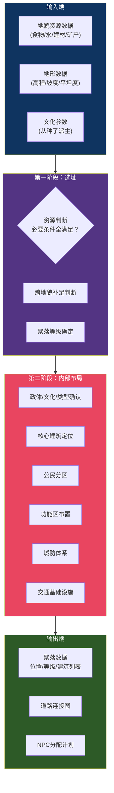
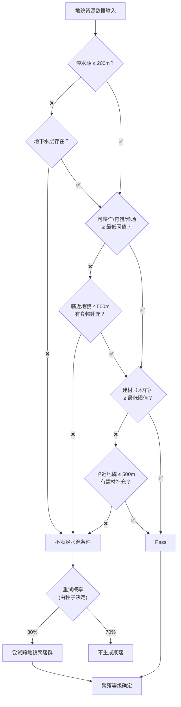
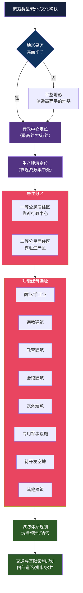
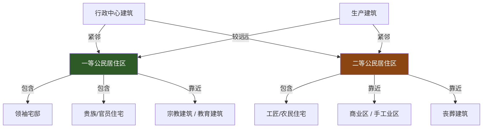
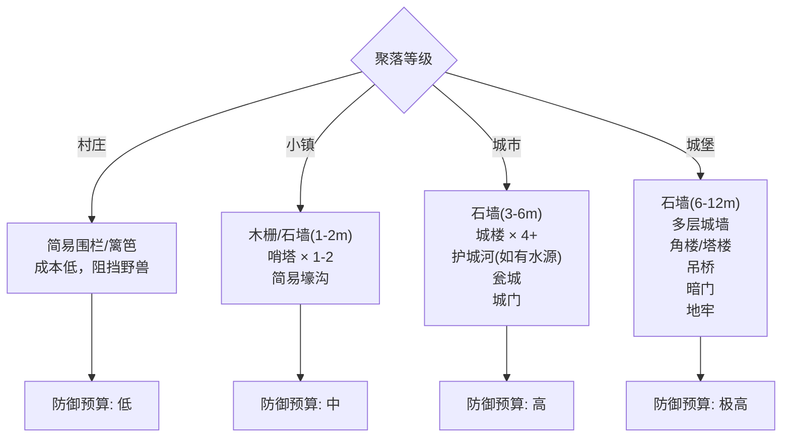
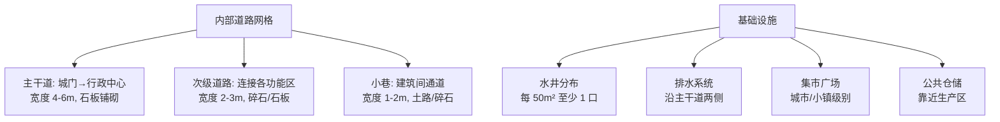
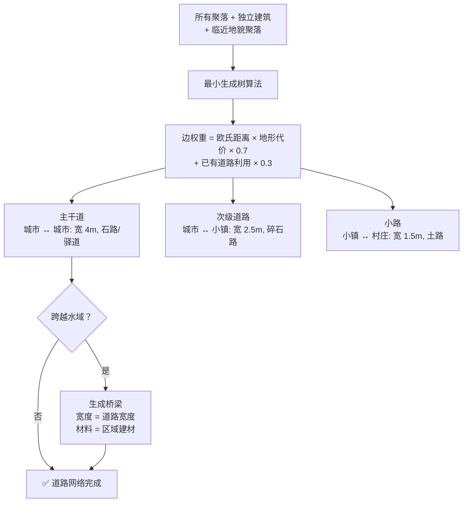

# 聚落生成规则

> 来源：`聚落生成规则01ver0.5` Canvas + `世界地形建筑生成规则ver0.5` Canvas  
> 状态：详细设计  
> 对应：`总设计草稿.md` §3.4 聚居区层次

---

## 一、总览

聚落生成是世界管线第四至第五阶段。它决定：在什么位置、生成什么等级的聚落、聚落内部如何布局。



---

## 二、选址逻辑

### 2.1 资源判断



### 2.2 聚落等级链

等级从低到高，高级聚落包含低级聚落的全部功能，并增加额外功能建筑：


**等级决定因素**：

| 因素 | 村庄 | 小镇 | 城市 | 城堡 |
|------|------|------|------|------|
| 资源种类 | 1-2 种 | 2-3 种 | 3-4 种 | 3-4 种 + 战略位置 |
| 农业资源 | 必须集中 | 可有可无 | 可有可无 | 可有可无 |
| 非农业资源 | 不需要 | 必须集中 | 必须集中 | 必须集中 |
| 生成概率 | 60% | 25% | 10% | 5% |
| 水资源 | 井/溪流 | 河流/湖泊 | 河流 | 河流 + 护城河水源 |

---

## 三、内部布局

### 3.1 布局总流程



### 3.2 公民分区逻辑



### 3.3 功能建筑选址逻辑

每种功能建筑根据聚落等级决定是否存在，根据文化/政体决定具体类型：

| 建筑类型 | 村庄 | 小镇 | 城市 | 城堡 | 选址规则 |
|----------|------|------|------|------|---------|
| 领袖宅邸 | 村长屋 | 镇长官邸 | 市政厅/王宫 | 要塞 | 最高处/中心 |
| 宗教建筑 | 小祠堂 | 庙宇 | 大教堂/寺院 | 城堡教堂 | 一等公民区 |
| 商业建筑 | 集市摊 | 商铺街 | 商会/市场 | 军需仓库 | 二等公民区 |
| 手工业 | 铁匠铺 | 作坊区 | 工厂/工会 | 军工作坊 | 靠近资源 |
| 教育建筑 | — | 私塾 | 学院/大学 | 军事学院 | 一等公民区 |
| 军事设施 | — | 哨站 | 军营/练兵场 | 城堡本体 | 边界/制高点 |
| 丧葬建筑 | 墓地 | 墓园 | 陵园/火葬场 | 英烈祠 | 城外边缘 |
| 会馆 | — | 行会馆 | 大使馆/公会 | — | 一等/二等公民区之间 |
| 娱乐建筑 | — | 酒馆 | 剧院/浴场 | — | 商业区 |
| 仓储建筑 | 谷仓 | 仓库 | 大型仓储区 | 军械库 | 靠近生产区 |
| 待开发空地 | 30% | 20% | 10% | 5% | 随机填充 |

---

## 四、城防体系



**城防由聚落预算决定**——聚落越富有，城防越完善。

---

## 五、交通与基础设施



---

## 六、聚落间道路规划



---

## 七、关键算法：聚落选址评分

对于每个候选位置，评分函数：

```
score = water_score × 0.35
      + food_score  × 0.30
      + build_score × 0.20
      + defense_score × 0.15
```

| 评分项 | 计算方式 |
|--------|---------|
| `water_score` | `1.0 - clamp(distance_to_water / 200, 0, 1)` |
| `food_score` | `min(food_production / min_threshold, 1.5) / 1.5` |
| `build_score` | `flatness × material_availability` |
| `defense_score` | `elevation_bonus + water_barrier_bonus` |

选择得分最高的候选位置。

---

## 八、与现有设计文档的对应

| 本文档概念 | `总设计草稿.md` 对应 |
|-----------|---------------------|
| 聚落等级链 | §3.4 聚居区层次（村庄→小镇→城市→城堡） |
| 资源判断 | §3.2 世界生成管线 步骤6 |
| 公民分区 | §4.6.2 社会阶层 |
| 城防体系 | §6.4 攻城战 |
| 道路规划 | §3.2 步骤9 |
