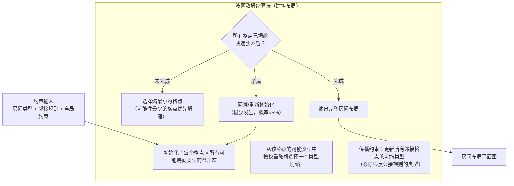
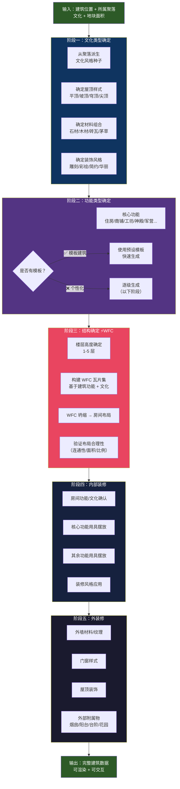
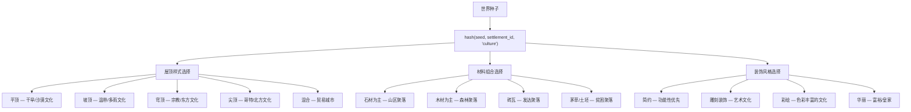
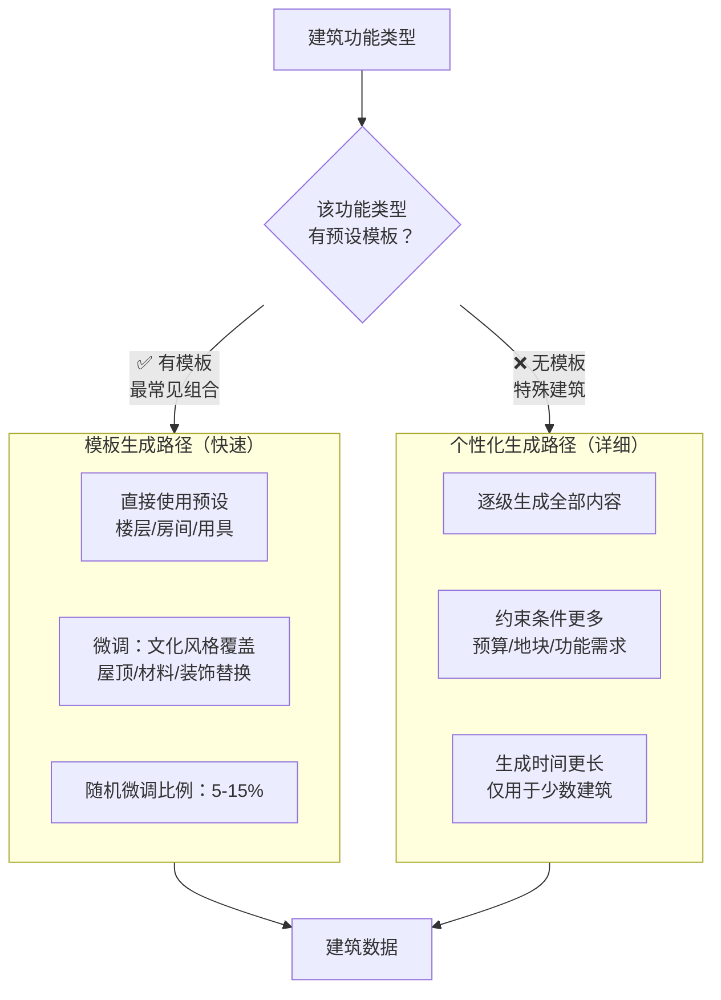
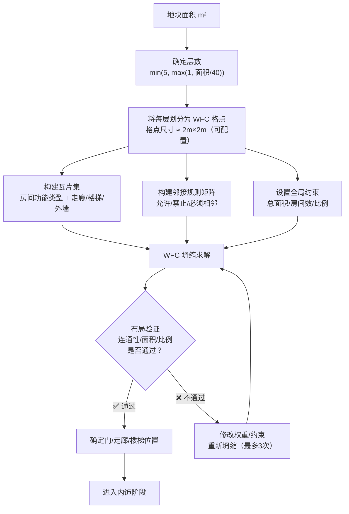
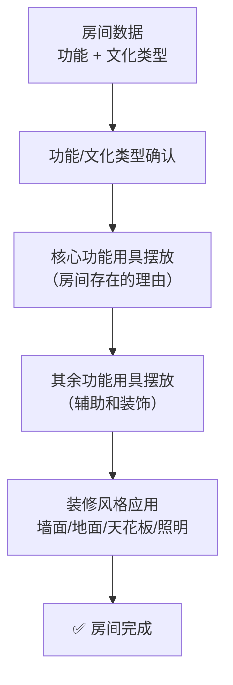
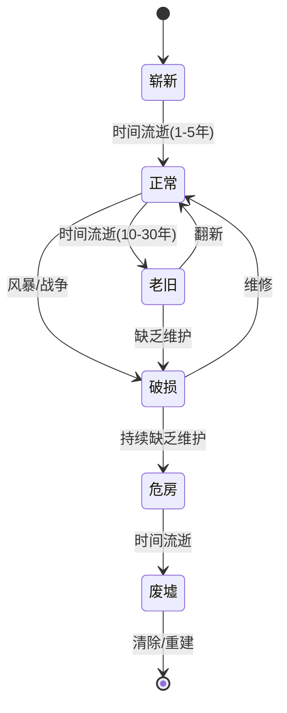

# 建筑生成规则

> 来源：`建筑生成规则0.5` Canvas  
> 状态：详细设计  
> 对应：`总设计草稿.md` §3.2 世界生成管线 步骤7 + §7.3 建筑系统  
> **更新 2026-06-02**：引入波函数坍缩（WFC）算法用于房间布局生成

---

## 〇、核心生成算法：波函数坍缩（Wave Function Collapse）

### 为什么引入 WFC

建筑内部的房间布局本质上是一个**约束满足问题**：
- 每个房间有功能类型（厨房、卧室、客厅……）
- 房间之间有邻接约束（厨房不能紧邻卧室？厨房应靠近储物间）
- 房间有面积约束（主厅最大，储物间最小）
- 房间有连通性约束（必须有门/走廊连接）

传统的"先确定楼层→再划分房间→再逐个填充"管线虽然直观，但容易产生不合理的布局（例如卧室被夹在厨房和铁匠铺之间）。WFC 一次性解决所有局部约束，生成既合理又有微妙变化的布局。

### WFC 在建筑生成中的应用

```
输入（约束定义）：
  ├─ 瓦片集（Tile Set）：每种房间功能类型 = 一种瓦片
  │    └─ 瓦片属性：最小/最大面积、必需的邻接、禁止的邻接、朝向偏好
  ├─ 邻接规则（Adjacency Rules）：哪些房间可以相邻、哪些必须相邻、哪些禁止相邻
  └─ 全局约束：总房间数、总面积、楼层数、各功能类型数量范围

输出：
  └─ 一个满足所有局部约束的楼层平面图（房间布局）
```



### WFC 与传统管线的分工

WFC 并不取代整个建筑生成管线——它专注于**阶段三（结构确定）**，即"房间如何布局"这个最需要约束求解的环节。其他阶段仍沿用原有管线：

| 阶段 | 算法 | 原因 |
|------|------|------|
| 文化类型确定 | 种子派生 + 规则映射 | 确定性、视觉风格不需要约束求解 |
| 功能类型确定 | 模板匹配 + 规则 | "这个建筑是什么"是离散选择 |
| **结构确定（房间布局）** | **WFC** | 房间间的邻接/面积/连通约束最适合约束求解 |
| 内部装修 | 模板 + 规则（详见[[04-房间生成规则]]） | 家具摆放虽有约束但更适合模板化 |
| 外装修 | 规则映射 | 文化→材料/屋顶的映射是确定的 |

### WFC 瓦片集定义

```gdscript
# 概念：每种房间功能类型作为 WFC 瓦片
class RoomTile:
    var function_type: int       # 房间功能 ID
    var min_area: float          # 最小面积 m²（例如卧室 ≥ 9m²）
    var max_area: float          # 最大面积 m²
    var min_count: int           # 该类型在此建筑中最少出现次数
    var max_count: int           # 最多出现次数
    var allowed_adjacent: Array[int]   # 可以相邻的功能类型
    var required_adjacent: Array[int]  # 必须相邻的功能类型（如厨房必须邻储物间）
    var forbidden_adjacent: Array[int] # 禁止相邻的类型
    var prefer_exterior: bool    # 是否偏好靠外墙（如客厅需要窗户）
    var prefer_ground_floor: bool # 是否必须在一楼（如商铺）
    var weight: float            # 生成权重（如卧室权重 > 书房权重）
```

### 与[[04-房间生成规则]]的关系

建筑生成（本文档）和房间生成（04文档）是两个不同粒度的阶段：

- **建筑生成（本文档）**：决定建筑的整体结构——楼层数、房间如何分布、房间之间如何连接。WFC 应用于此。
- **房间生成（[[04-房间生成规则]]）**：决定每个房间内部的家具摆放和装修风格。使用模板+规则。

**关于合并的判断**：两个文档当前不合并，因为：
1. 它们处于不同的生成粒度（建筑级 vs 房间级）
2. 它们使用不同的算法（WFC vs 模板）
3. 在管线中它们是先后执行的独立阶段

但如果未来发现 WFC 应用于房间内部家具布局更合适，可将两个文档合并为统一的"建筑与房间约束生成规则"。

---

## 一、总览

建筑生成是聚落内部布局之后的下一个细化阶段。每个建筑从文化类型确定开始，经过功能→结构（WFC）→房间→内饰→外装的逐级生成。



---

## 二、文化类型确定

建筑的视觉风格从所属聚落的文化参数派生。文化参数本身从世界种子派生。



**文化混合规则**：位于多种文化交界处的聚落，建筑风格按 70/30 比例混合两种文化。

---

## 三、模板建筑 vs 个性化建筑



**模板覆盖策略**：

| 建筑类型 | 使用模板 | 理由 |
|----------|---------|------|
| 普通民居 | ✅ 90% | 高度重复，模板高效 |
| 商铺 | ✅ 70% | 基本结构相似，内饰不同 |
| 铁匠铺 | ✅ 80% | 功能布局固定 |
| 神殿/教堂 | ❌ 0% | 每种文化需要独特设计 |
| 王宫/要塞 | ❌ 0% | 聚落唯一，需要独特性 |
| 酒馆 | ✅ 50% | 结构相似但内饰差异大 |
| 学院 | ❌ 20% | 规模差异大 |

---

## 四、楼层与房间确定（WFC 驱动）

### 4.1 WFC 布局流程



### 4.2 邻接规则矩阵（示例）

行=房间A，列=房间B。值：✅=允许相邻，❌=禁止相邻，⭐=必须相邻。

|  | 主厅 | 卧室 | 厨房 | 储物 | 走廊 | 书房 | 工坊 |
|--|------|------|------|------|------|------|------|
| **主厅** | — | ✅ | ✅ | ✅ | ⭐ | ✅ | ❌ |
| **卧室** | ✅ | — | ❌ | ✅ | ⭐ | ✅ | ❌ |
| **厨房** | ✅ | ❌ | — | ⭐ | ✅ | ❌ | ❌ |
| **储物** | ✅ | ✅ | ⭐ | — | ✅ | ❌ | ✅ |
| **走廊** | ⭐ | ⭐ | ✅ | ✅ | — | ✅ | ✅ |
| **书房** | ✅ | ✅ | ❌ | ❌ | ✅ | — | ❌ |
| **工坊** | ❌ | ❌ | ❌ | ✅ | ✅ | ❌ | — |

> 注：此矩阵为基础默认值。不同文化、不同建筑功能类型会有不同的邻接规则变体。例如北方寒冷文化的民居要求厨房与主厅必须相邻（共用炉火取暖）。

### 4.3 房间分配比例（以民居为例）

WFC 的全局约束——各功能类型在此建筑中的目标数量/面积比例：

| 房间类型 | 面积占比 | 每层最少数量 | 说明 |
|----------|---------|-------------|------|
| 主厅/起居室 | 25% | 1 | 核心房间，优先靠外墙+有窗 |
| 卧室 | 30% | 1-3 | 数量 = 住户人数相关 |
| 厨房 | 15% | 1 | 必须邻储物间，需烟囱/排烟 |
| 储物间 | 10% | 1 | 必须邻厨房或工坊 |
| 走廊/楼梯 | 15% | — | WFC 自动填充连接空间 |
| 其他（书房/工坊） | 5% | 0-1 | 按 NPC 职业决定是否出现 |

### 4.4 WFC 回溯策略

当 WFC 遇到矛盾（某格点无可选类型）时：
1. **轻度矛盾**（<10% 格点受影响）：局部重试——放宽受影响区域的约束，重新坍缩
2. **中度矛盾**（10-30%）：调整权重——降低冲突类型的权重，重新全局坍缩
3. **重度矛盾**（>30% 或重试3次仍失败）：回退到传统逐级生成管线（作为安全网）

---

## 五、内饰与外装修

### 5.1 内饰填充流程

详见 [`04-房间生成规则.md`](./04-房间生成规则.md)

简化流程：



### 5.2 外装修


**外部附属物按建筑等级**：

| 建筑等级 | 附属物 |
|----------|--------|
| 简陋 | 无 |
| 普通 | 台阶 |
| 良好 | 台阶 + 阳台 |
| 豪华 | 台阶 + 阳台 + 花园 |
| 宫殿级 | 台阶 + 阳台 + 花园 + 雕塑 + 喷泉 |

---

## 六、建筑质量衰减模型

建筑不是永恒的——随时间和事件产生质量变化：



**维护与 NPC 行为挂钩**：有主人的建筑定期维护；废弃建筑随时间恶化。

---

## 七、关键数据结构

```gdscript
# building_data.gd (概念)
class BuildingData:
    var position: Vector3
    var culture_type: int           # 文化类型 ID
    var function_type: int          # 功能类型 ID
    var floor_count: int            # 1-5
    var rooms: Array[RoomData]      # 房间列表
    var quality_level: int          # 0=简陋 ~ 4=宫殿
    var exterior_style: Dictionary  # 屋顶/材料/装饰
    var condition: float            # 1.0=崭新 ~ 0.0=废墟
    var owner_npc_id: String        # 所属 NPC（可为空）
    var build_year: int             # 建造时间（游戏年）
```

---

## 八、实现优先度

| 优先级 | 内容 | 理由 |
|--------|------|------|
| 🔴 P0 | 模板建筑生成 | 先让聚落有房子 |
| 🔴 P0 | 文化类型 → 屋顶/材料选择 | 视觉差异化 |
| 🔴 P0 | WFC 房间布局（基础版） | 用简单邻接规则生成合理布局 |
| 🟡 P1 | WFC 邻接规则扩展（文化变体） | 不同文化的房间邻接偏好 |
| 🟡 P1 | 个性化建筑生成 | 重要建筑独特性 |
| 🟡 P1 | 内饰填充 | NPC 交互需要室内场景（见[[04-房间生成规则]]） |
| 🟢 P2 | WFC 回溯/矛盾处理优化 | 减少布局失败率 |
| 🟢 P2 | 外装修细节 | 锦上添花 |
| 🟢 P2 | 质量衰减模型 | 需要 NPC 维护行为配合 |
