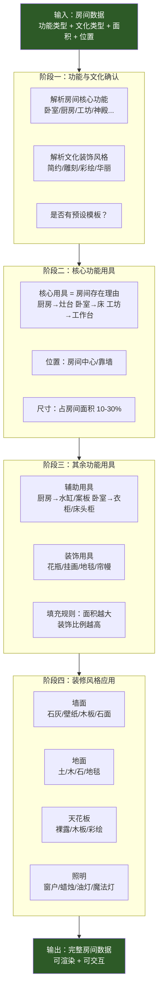
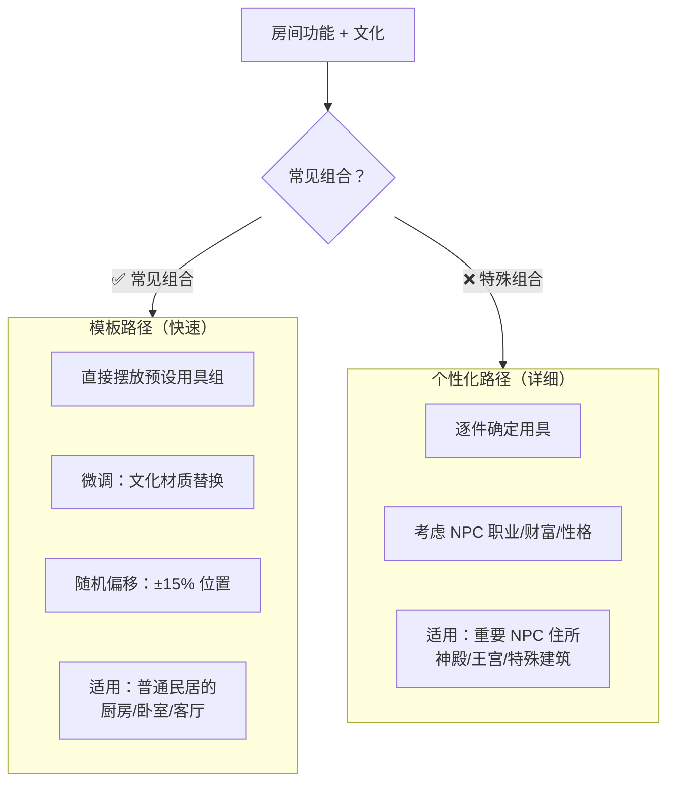
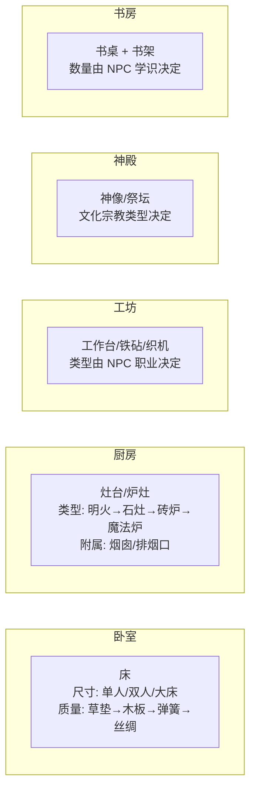
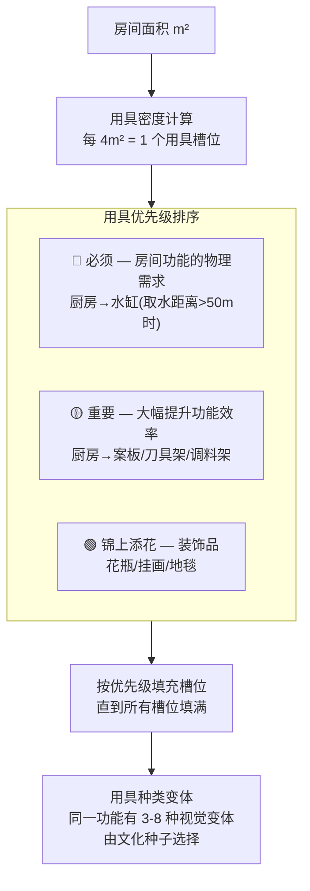
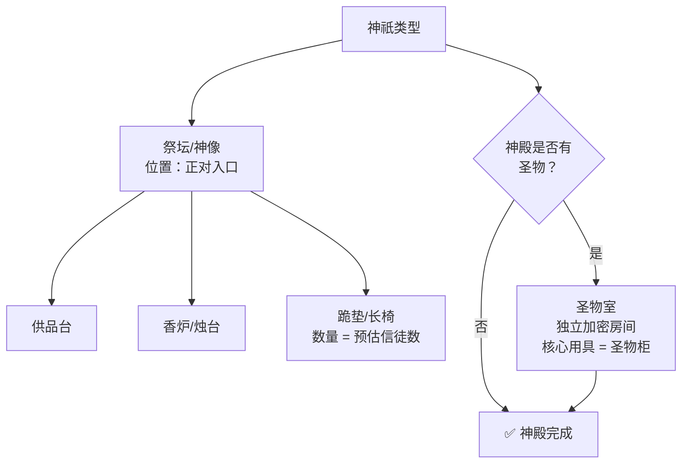
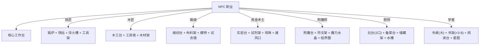
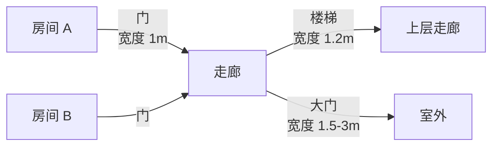

# 房间生成规则

> 来源：`房间生成规则0.5` Canvas  
> 状态：详细设计  
> 对应：`总设计草稿.md` §3.2 + `03-建筑生成规则.md` 阶段四  
> **更新 2026-06-02**：家具系统详见 `开发阶段/家具系统设计.md`；建筑布局引入 WFC（见[[03-建筑生成规则]] §〇）

---

## 一、总览

房间生成是建筑内部装修的最后阶段。每个房间从功能和文化确认开始，经过核心用具→辅助用具→装修的三层细化。



---

## 二、模板 vs 个性化

与建筑生成一致，房间也有模板和个性化两条路径：



**模板覆盖率**：

| 房间类型 | 模板化比例 |
|----------|-----------|
| 普通卧室 | 95% |
| 普通厨房 | 90% |
| 普通客厅 | 85% |
| 铁匠铺工坊 | 80% |
| 神殿内室 | 20% |
| NPC 专属房间 | 0%（全部个性化） |

---

## 三、核心功能用具

**核心用具 = 定义房间用途的那件物品。**



**核心用具质量等级**：

| 等级 | 材料 | 耐久度 | 使用效果 | 所属 NPC 财富 |
|------|------|--------|---------|-------------|
| 0 | 粗制木材/石头 | 100 | 基础功能 | 贫困 |
| 1 | 普通木材 | 200 | 基础功能 | 普通 |
| 2 | 优质木材/铁件 | 400 | +10% 效率 | 小康 |
| 3 | 硬木/钢件 | 800 | +20% 效率 | 富裕 |
| 4 | 稀有材料/魔法 | 1600 | +35% 效率 | 富豪/贵族 |

---

## 四、其余功能用具



**用具变体示例（厨房-案板）**：

| 文化风格 | 案板变体 | 材质 |
|----------|---------|------|
| 北方简约 | 厚重木墩 | 松木 |
| 东方精致 | 长条案板 | 竹制 |
| 南方奢华 | 大理石面板 | 大理石 + 金边 |
| 沙漠实用 | 石板 | 砂岩 |

> 📘 **完整家具设计**：家具的详细分类、功能、质量等级和文化变体见 `开发阶段/家具系统设计.md`。

---

## 五、装修风格应用

```mermaid
flowchart TD
    Culture["文化种子"] --> Wall["墙面处理"]
    Culture --> Floor["地面处理"]
    Culture --> Ceiling["天花板处理"]
    Culture --> Light["照明方式"]
    
    Wall --> W1["石灰刷白 — 简约"]
    Wall --> W2["壁纸 — 舒适"]
    Wall --> W3["木板镶 — 温暖"]
    Wall --> W4["石面裸 — 粗犷"]
    Wall --> W5["彩绘壁画 — 华丽"]
    
    Floor --> FL1["夯土 — 简陋"]
    Floor --> FL2["木板 — 普通"]
    Floor --> FL3["石板 — 良好"]
    Floor --> FL4["地毯覆盖 — 舒适"]
    Floor --> FL5["拼花木/大理石 — 豪华"]
    
    Ceiling --> CL1["裸露梁架 — 简陋"]
    Ceiling --> CL2["木板封顶 — 普通"]
    Ceiling --> CL3["彩绘天花板 — 华丽"]
    Ceiling --> CL4["穹顶/藻井 — 宫殿"]
    
    Light --> LT1["窗户采光 — 昼间"]
    Light --> LT2["蜡烛 — 夜间简陋"]
    Light --> LT3["油灯 — 夜间普通"]
    Light --> LT4["魔法灯 — 持续照明/富裕"]
```



---

## 六、特殊房间类型

某些房间有独特生成逻辑：

### 6.1 神殿内室



### 6.2 NPC 职业工坊



---

## 七、房间连通性

房间不是孤立的——通过门、走廊、楼梯连接：



**连接规则**：
- 同一楼层：相邻房间直接开门，非相邻房间通过走廊连接
- 跨楼层：楼梯连接（位置在建筑生成阶段已确定）
- 门类型：普通木门/铁门/拱门/屏风（由文化决定）

---

## 八、性能考量

房间生成的数量级分析：

| 聚落等级 | 建筑数 | 每建筑平均房间数 | 总房间数 |
|----------|--------|-----------------|---------|
| 村庄 | 15-40 | 2-4 | 30-160 |
| 小镇 | 50-150 | 3-6 | 150-900 |
| 城市 | 200-1500 | 4-10 | 800-15000 |
| 城堡 | 30-80 | 5-15 | 150-1200 |

**优化策略**：
- 模板房间 O(1) 生成，仅个性化房间需要详细计算
- 未进入玩家视野的房间不生成内饰（LOD 延迟）
- 房间数据使用紧凑二进制格式，非交互距离用统计摘要

---

## 九、关键数据结构

```gdscript
# room_data.gd (概念)
class RoomData:
    var function_type: int          # 房间功能 ID
    var culture_style: int          # 文化风格 ID
    var area: float                 # 面积 m²
    var position: Vector3           # 房间中心位置
    var core_furniture: FurnitureData    # 核心用具
    var other_furniture: Array[FurnitureData]  # 其余用具
    var wall_style: int             # 墙面风格
    var floor_style: int            # 地面风格
    var ceiling_style: int          # 天花板风格
    var lighting: Array[LightData]  # 照明源

class FurnitureData:
    var type: int                   # 用具类型 ID
    var quality: int                # 0-4
    var position: Vector3           # 相对位置
    var rotation: float             # 朝向
    var is_interactive: bool        # 是否可交互
    var storage_inventory: Array    # 容器内容（如果是容器）
```
