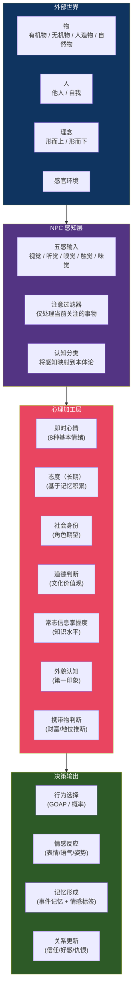
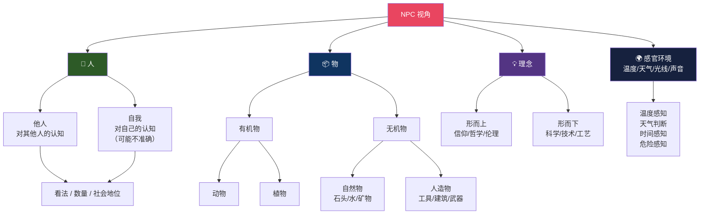
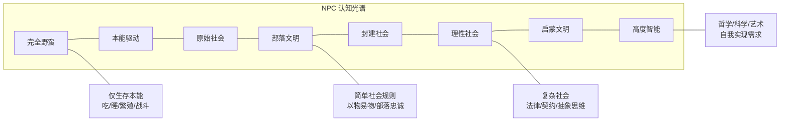
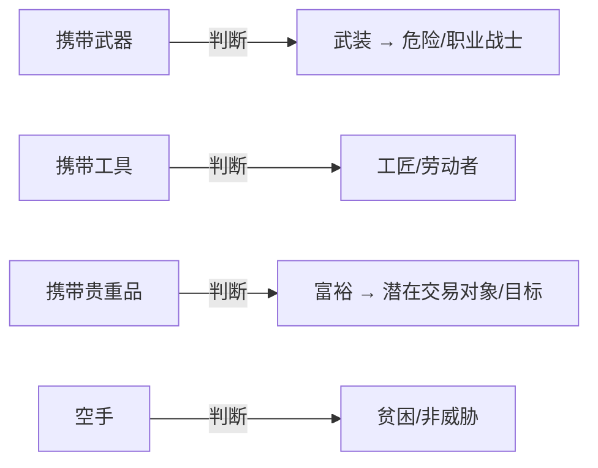
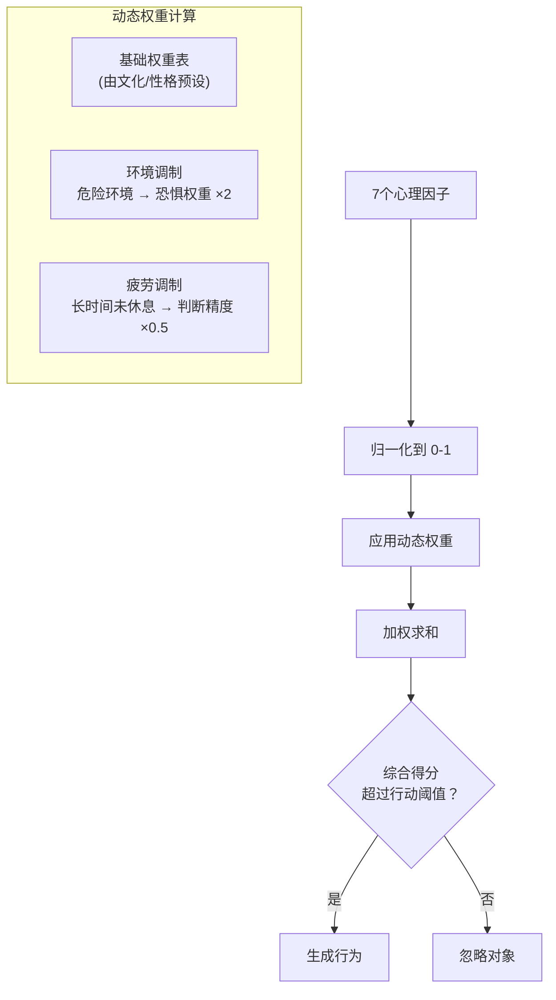
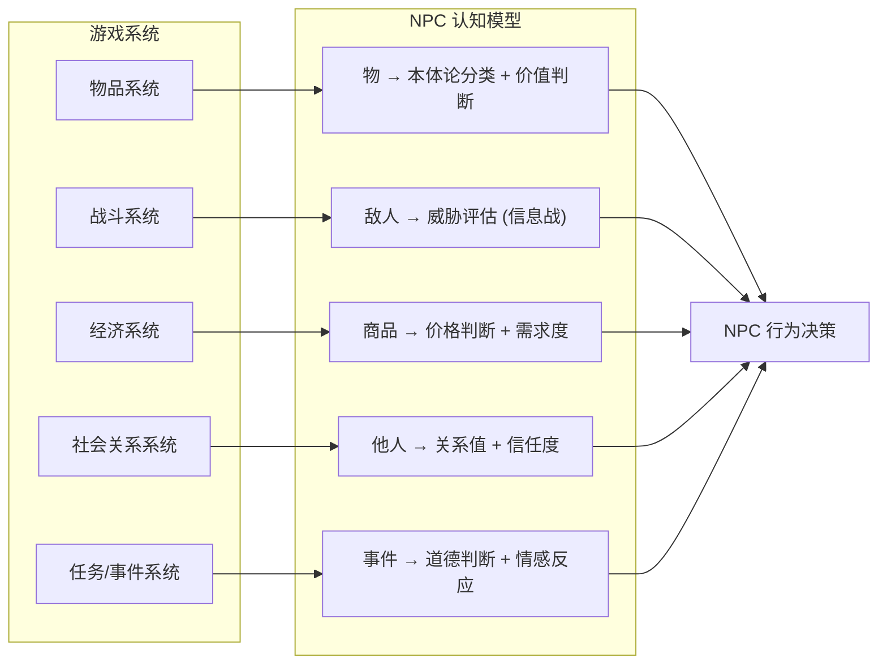

# NPC 认知模型

> 来源：`NPC视角设想图1-对事物` + `NPC视角设想图 2` + `角色处理对象时的心理作用` 三个 Canvas  
> 状态：详细设计  
> 对应：`总设计草稿.md` §4 NPC 系统 + `NPC活人感开发文档ver1.01short.md`

---

## 一、总览

NPC 不是"看到"游戏数据——他们通过一个认知模型理解世界。这个模型决定了 NPC 如何分类事物、如何对事物做出反应、以及如何在社会互动中形成判断。



---

## 二、NPC 本体论：世界是怎么分类的

Canvas `NPC视角设想图1-对事物` 定义了 NPC 认知世界的本体论分类体系。这是 NPC "理解"世界的基础框架。



### 2.1 认知不等于真实

NPC 的本体论分类可能出错：

| 实际情况 | NPC 可能认知为 | 原因 |
|----------|-------------|------|
| 附魔剑（人造物+魔法） | 普通人造物 | 知识不足 |
| 稀有动物 | 神话生物 | 恐惧/迷信 |
| 敌对 NPC 伪装友善 | 友善 NPC | 信息不对称 |
| 自然现象（日食） | 超自然事件（神怒） | 缺乏科学知识 |

**这种认知偏差是 emergent storytelling 的关键来源。**

---

## 三、智能 ↔ 野蛮 维度

Canvas `NPC视角设想图 2` 极其简洁：NPC 视角在"智能"和"野蛮"两个极之间。

这不是二元对立，而是一个**光谱**：



**每个 NPC 在这个光谱上有一个位置**，由以下因素决定：

| 因素 | 权重 | 说明 |
|------|------|------|
| 所属文化的科技水平 | 40% | 文化基底 |
| 教育程度 | 25% | 个人学识 |
| 智力属性 | 20% | 先天智力 |
| 生活经历 | 15% | 旅行/阅读/交流 |

NPC 在光谱上的位置影响其**所有认知判断**——两个 NPC 看到同一件事，可能得出完全不同的结论。

---

## 四、角色对对象的心理加工

Canvas `角色处理对象时的心理作用` 是最详细的一个。它描述了当 NPC 与某个"对象"（人/物/事件）互动时，哪些心理因素参与加工。

```mermaid
flowchart TD
    Event["NPC 遇到对象\n（人/物/事件）"] --> MultiFactor
    
    subgraph MultiFactor["多维心理加工"]
        direction TB
        
        F1["⚡ 即时心情\n8种基本情绪当前值\n决定初始反应色调"]
        F2["🧠 态度（长期）\n基于与该对象的历史互动\n记忆积累形成的稳定倾向"]
        F3["👔 社会身份\n角色期望与身份约束\n'我应该怎么做'"]
        F4["⚖️ 道德\n文化内化的价值判断\n对/错/善/恶"]
        F5["📚 常态信息掌握度\n对该类对象的了解程度\n专家 vs 外行"]
        F6["👁️ 外貌认知\n第一印象/刻板印象\n外表推断内在"]
        F7["🎒 携带物判断\n通过拥有的物品推断\n财富/地位/意图"]
        F8["🌍 环境\n当前环境条件对判断的影响\n危险/舒适/陌生/熟悉"]
    end
    
    MultiFactor --> Integration
    
    subgraph Integration["整合加工"]
        I1["各因子加权叠加\n权重 = f(性格, 文化, 当前状态)"]
        I2["情绪标签附着\n正面/负面/中性"]
        I3["行为倾向生成\n趋近/回避/攻击/忽视"]
    end
    
    Integration --> Output
    
    subgraph Output["输出"]
        O1["行为决策\n(GOAP 目标/LLM 社会行为)"]
        O2["记忆写入\n(事件 + 情感标签 + 关键细节)"]
        O3["关系更新\n(与该对象的关系值变化)"]
    end

    style Event fill:#e94560,color:#fff
    style MultiFactor fill:#1a1a2e
    style Integration fill:#533483,color:#fff
    style Output fill:#2d5a27,color:#fff
```



### 4.1 各因子的详细设计

#### 即时心情（8种基本情绪）

来自 `总设计草稿.md` Plutchik 情绪轮：

| 情绪 | 触发条件示例 | 对判断的影响 |
|------|------------|------------|
| 😡 愤怒 | 被攻击/欺骗/侮辱 | -70% 信任倾向，+50% 攻击倾向 |
| 😱 恐惧 | 生命威胁/未知事物 | -80% 趋近倾向，+90% 逃跑倾向 |
| 😢 悲伤 | 失去重要事物 | -50% 社交意愿，+30% 自我反思 |
| 😊 喜悦 | 目标达成/获得奖励 | +40% 社交意愿，+30% 慷慨度 |
| 🤢 厌恶 | 不道德行为/肮脏环境 | -60% 好感变化率 |
| 😲 惊讶 | 意外事件 | 暂时覆盖其他情绪 ×0.5 |
| 🔍 好奇 | 新事物/未知信息 | +50% 趋近倾向 |
| 😴 无聊 | 缺乏刺激 | +80% 探索倾向 |

#### 态度（长期记忆）

态度由 NPC 与对象的历史互动积累形成：

```
attitude = Σ(memory.impact × decay_factor(time_since_memory))
```

- 正向经历积累 → 好感
- 负向经历积累 → 厌恶
- 态度影响对该对象所有未来互动的初始权重

#### 社会身份

| 身份维度 | 示例 | 行为约束 |
|----------|------|---------|
| 职业角色 | 铁匠/卫兵/商人/农民 | 工作时间做什么 |
| 社会阶层 | 贵族/平民/奴隶 | 对谁可以说什么 |
| 家庭角色 | 父亲/母亲/子女/孤儿 | 家庭责任 |
| 宗教角色 | 祭司/信徒/异教徒 | 宗教行为规范 |

#### 道德判断

来自 `总设计草稿.md` 道德体系，不同文化有不同道德权重：

| 道德维度 | 高权重文化 | 低权重文化 |
|----------|-----------|-----------|
| 诚实 | 秩序型社会 | 生存优先型社会 |
| 忠诚 | 封建/军事文化 | 个人主义文化 |
| 仁慈 | 宗教文化 | 弱肉强食文化 |
| 荣誉 | 骑士/武士文化 | 商业文化 |
| 纯洁 | 禁欲主义文化 | 享乐主义文化 |

#### 常态信息掌握度

NPC 对该类对象的专业知识水平（0-100）：

| 等级 | 范围 | 效果 |
|------|------|------|
| 无知 | 0-10 | 完全依赖刻板印象 |
| 略知 | 11-30 | 有基本概念但可能错误 |
| 了解 | 31-60 | 准确判断常见属性 |
| 精通 | 61-85 | 能发现隐藏特质 |
| 专家 | 86-100 | 几乎完全准确的判断 |

#### 外貌认知

NPC 根据外貌快速推断对象的属性（可能有偏误）：

| 外貌线索 | 推断属性 | 准确度 |
|----------|---------|--------|
| 衣着质量 | 财富 | 中 |
| 伤痕 | 战斗经验 | 中 |
| 体态 | 力量/敏捷 | 高 |
| 面部特征 | 性格 | 低（刻板印象） |
| 种族/物种 | 文化背景 | 中 |

#### 携带物判断

看到对象携带什么物品 → 推断其职业/财富/意图：



---

## 五、心理因子整合算法



**基础权重表**（示例——不同性格有不同权重）：

| 性格维度 | 即时心情 | 态度 | 身份 | 道德 | 信息 | 外貌 | 携带物 |
|----------|---------|------|------|------|------|------|------|
| 外向型 | 35% | 20% | 10% | 5% | 10% | 10% | 10% |
| 谨慎型 | 10% | 30% | 10% | 20% | 15% | 5% | 10% |
| 道德型 | 5% | 15% | 10% | 40% | 10% | 10% | 10% |

---

## 六、认知模型与游戏系统的接口



---

## 七、关键数据结构

```gdscript
# npc_perception.gd (概念)
class NPCPerceptionData:
    # 本体论分类
    var ontology_map: Dictionary = {
        "person": {"self": {}, "others": {}},
        "thing": {"organic": {}, "inorganic": {}},
        "idea": {"metaphysical": {}, "physical": {}},
        "environment": {}
    }
    
    # 对特定对象的心理状态
    var attitude_toward: Dictionary   # {object_id: float(-1.0~1.0)}
    var knowledge_level: Dictionary   # {object_type: float(0~100)}
    var impression: Dictionary        # {object_id: ImpressionData}

class ImpressionData:
    var first_impression: float       # -1.0 ~ 1.0
    var appearance_rating: float      # 外貌推断值
    var possession_judgment: String   # 携带物推断
    var moral_judgment: float         # 道德判断 -1.0(恶)~1.0(善)
    var threat_assessment: float      # 0.0 ~ 1.0

# 心理加工时的因子权重
class PsychologyWeights:
    var instant_mood: float = 0.25
    var attitude: float = 0.25
    var social_identity: float = 0.10
    var morality: float = 0.15
    var knowledge: float = 0.10
    var appearance: float = 0.08
    var possessions: float = 0.07
```

---

## 八、与其他系统的关系

| 系统 | 使用 NPC 认知模型的什么 |
|------|----------------------|
| GOAP 规划器 | 因子整合后的行为倾向 |
| LLM 社会行为 | 完整的认知状态（作为 prompt 上下文） |
| 情绪系统 | 即时心情的读写 |
| 记忆系统 | 态度更新需要写入新记忆 |
| 战斗信息战 | 威胁评估 + 外貌认知（估计敌人实力） |
| 经济系统 | 常态信息掌握度影响价格判断 |
| 关系网络 | 态度 = 关系值的基础 |
