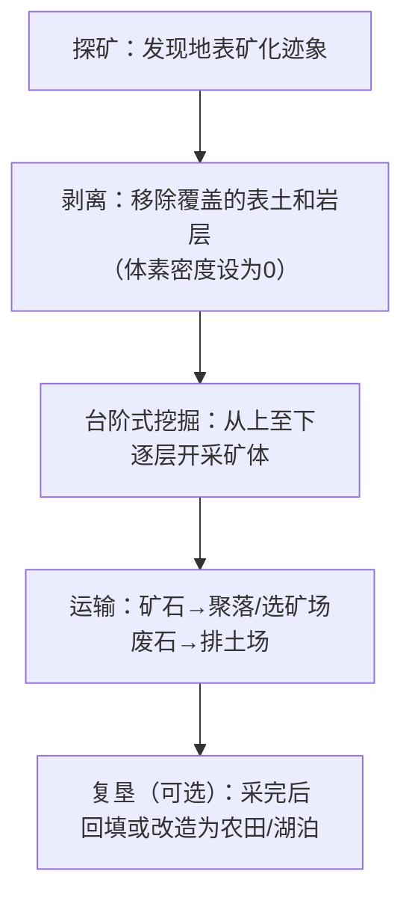
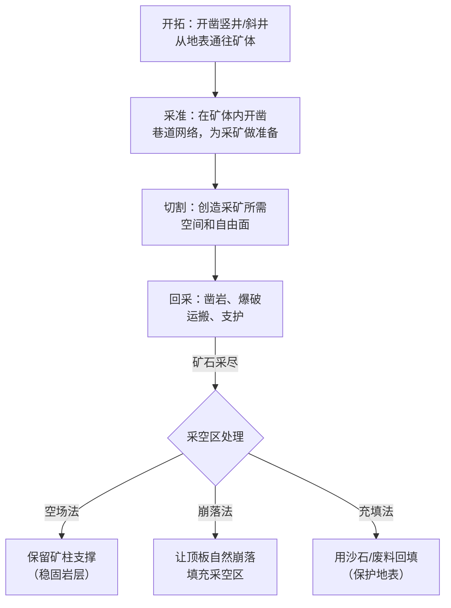
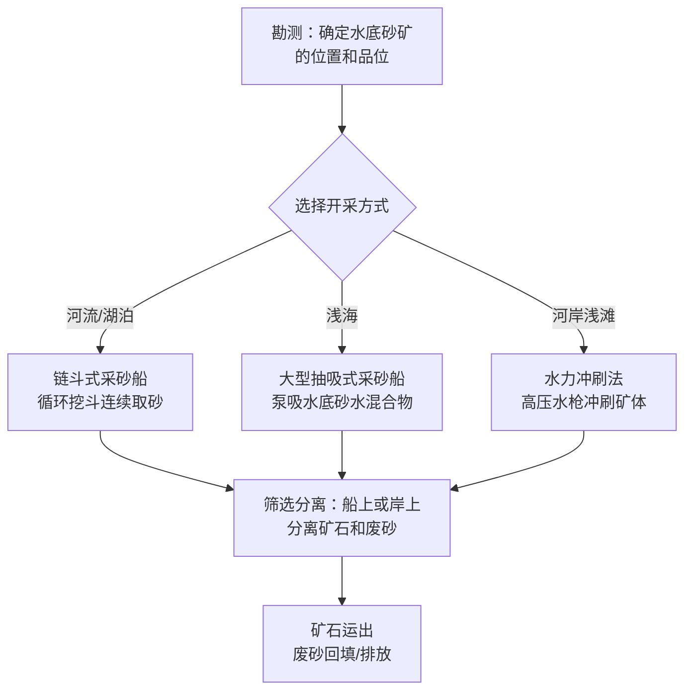
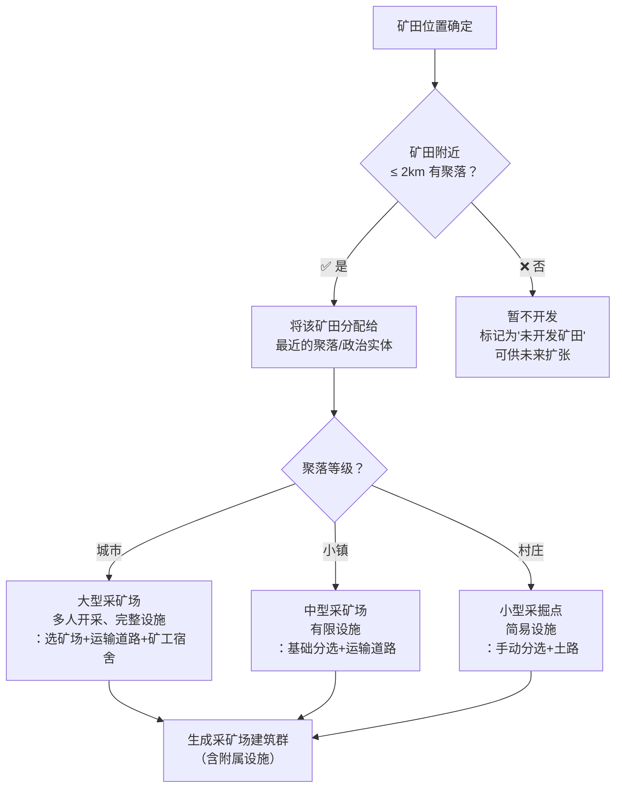
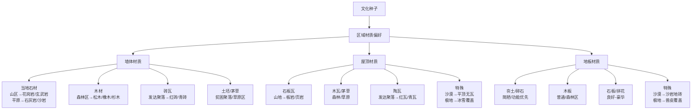

# 体素设计决策

> **核心问题：哪些事物用体素表示？哪些不？**  
> 此文档是体素世界实现前最重要的决策文件。  
> 状态：设计决策定稿  
> 对应：`总设计草稿.md` §3.1 体素世界  
> **更新 2026-06-02**：新增采矿系统设计、矿物分布与储量、采矿方式、采石场预生成、建筑材质与文化关联

---

## 〇、根本原则

```
体素 = 世界的地形骨架
网格 = 地形之上的一切
```

**体素负责大地**——山怎么长、河怎么流、矿在哪儿、玩家能不能挖洞。  
**网格负责万物**——树、房子（外壳）、家具、NPC、武器、装饰。

这不是 Minecraft——不是所有东西都是方块。这是 Valheim/雾锁王国式的**连续表面体素地形 + 网格物体**混合世界。

---

## 一、体素层：大地素材表

### 1.1 体素网格规格

| 参数 | 值 | 说明 |
|------|-----|------|
| 体素单位尺寸 | 0.5m³/体素 | 地形精度——够精细表示洞穴和悬崖 |
| 区块尺寸 | 32×32×? 体素 | 约16m×16m×可变高度/chunk |
| 世界理论最大 | 16km×16km | 32×32超区块(500m每个) |
| 初始可玩区域 | 4km×4km | 阶段〇~三使用，之后扩展 |
| 存储方式 | 稀疏体素八叉树(SVO) | 空气不存储，地表附近高密度 |
| 内存目标/chunk | <1MB | 含密度+材质ID |
| LOD层级 | 0(全细节) ~ 3(远景) | Transvoxel算法 |
| LOD0 范围 | 玩家周围 64m | 全分辨率渲染 |
| LOD1 范围 | 64-128m | 2×2体素合并 |
| LOD2 范围 | 128-256m | 4×4体素合并 |
| LOD3 范围 | 256m+ | 8×8体素合并，纯轮廓 |

### 1.2 体素材质类型

每个体素格存储两个值：`density(0=空气~1=实心)` + `material_id`。

#### 天然材质（世界生成管线产出）

| ID | 材质 | 颜色槽 | 硬度 | 可挖掘 | 挖掘产物 | 生成位置 |
|----|------|--------|------|--------|---------|---------|
| 0 | 空气 | — | — | — | — | 无处不在 |
| 1 | 泥土 | 棕色系 | 1 | ✅ 手/铲 | 泥土 | 地表层(0~3m) |
| 2 | 草皮 | 绿色系 | 1 | ✅ 手/铲 | 泥土 | 地表最顶1层 |
| 3 | 沙 | 黄褐色系 | 0.5 | ✅ 手 | 沙子 | 沙漠/河岸/海滩 |
| 4 | 粘土 | 红褐色系 | 1.5 | ✅ 铲 | 粘土 | 河床/湖泊底 |
| 5 | 碎石 | 灰色系 | 2 | ✅ 镐 | 石头 | 地表下1~5m过渡层 |
| 6 | 石头 | 灰色系 | 3 | ✅ 镐 | 石头 | 主地层(5m以下) |
| 7 | 花岗岩 | 粉灰色 | 5 | ✅ 镐(铁+) | 花岗岩石材 | 山区深层 |
| 8 | 玄武岩 | 暗灰色 | 6 | ✅ 镐(钢+) | 玄武岩石材 | 火山地带 |
| 9 | 大理石 | 白色 | 4 | ✅ 镐 | 大理石石材 | 特殊地质层 |
| 10 | 沙岩 | 橙褐色 | 2 | ✅ 镐 | 沙岩石材 | 沙漠地层 |
| 11 | 雪 | 白色 | 0.3 | ✅ 手 | 雪球 | 雪山/极地地表 |
| 12 | 冰 | 浅蓝半透明 | 2 | ✅ 镐 | 冰块 | 极地/高山 |
| 13 | 黑曜石 | 深紫黑 | 10 | ⚠️ 镐(钻石+) | 黑曜石 | 火山/深层 |

#### 矿石材质（嵌在地层中，概率分布）

| ID | 材质 | 颜色槽 | 概率 | 生成地层 | 挖掘产物 |
|----|------|--------|------|---------|---------|
| 20 | 煤矿 | 深黑 | 常见 | 地下5~40m | 煤炭 |
| 21 | 铜矿 | 铜绿 | 常见 | 地下5~30m | 铜矿石 |
| 22 | 铁矿 | 铁锈红 | 较常见 | 地下10~60m | 铁矿石 |
| 23 | 锡矿 | 灰银 | 一般 | 地下5~25m | 锡矿石 |
| 24 | 银矿 | 银白 | 稀有 | 地下20~80m | 银矿石 |
| 25 | 金矿 | 金黄 | 稀有 | 地下30~100m | 金矿石 |
| 26 | 秘银矿 | 淡蓝银 | 极稀有 | 地下80~200m | 秘银矿石 |
| 27 | 水晶矿 | 透明多色 | 稀有 | 洞穴/深层 | 水晶 |
| 28 | 魔法水晶矿 | 紫红荧光 | 极稀有 | 特殊群系深层 | 魔法水晶 |

#### 液体材质（密度=0.5代表液体）

| ID | 材质 | 说明 |
|----|------|------|
| 30 | 水 | 流动体素，密度=0.5，水面以上空气 |
| 31 | 岩浆 | 流动体素，密度=0.5，发光，伤害 |

#### 有机材质

| ID | 材质 | 说明 |
|----|------|------|
| 40 | 腐殖土 | 森林地表，肥沃 |
| 41 | 泥炭 | 沼泽地表 |
| 42 | 菌丝土 | 魔法森林/洞穴地表 |

### 1.2.5 采矿与破坏机制

#### 魔法破坏

**所有体素都可以通过魔法破坏。**（魔法系统详见[[01-魔法]]和[[02-元素]]，当前尚未完整设计。魔法破坏的机制留待魔法系统设计完成后再细化。）

魔法破坏的预期特性：
- 不受体素硬度的限制——魔法可以破坏黑曜石等常规工具无法处理的材料
- 不同元素对不同类型的体素可能有效率差异（例如火元素对冰体素有加成）
- 大面积魔法破坏消耗较高（魔力/施法材料/冷却时间）
- 魔法采矿可能在产量上有加成或惩罚（取决于魔法与矿物的属性匹配）

#### 工具挖掘

**所有等级的矿物、体素都可以被任意等级（任意坚硬度）的挖掘工具破坏。** 但存在产量折扣：

| 工具等级 vs 体素硬度 | 挖掘速度 | 产量 | 说明 |
|----------------------|---------|------|------|
| 工具等级 ≥ 体素硬度 | 100% | 100% | 正常开采 |
| 工具等级 = 体素硬度 - 1 | 70% | 80% | 勉强开采，有一定损耗 |
| 工具等级 = 体素硬度 - 2 | 45% | 55% | 困难开采，损耗较大 |
| 工具等级 ≤ 体素硬度 - 3 | 20% | 25% | 极难开采，大部分矿物被浪费 |
| 工具类型不对应 | ×0.6倍速 | ×0.5产量 | 如用镐挖沙、用铲挖石头 |

**工具类型与体素的对应关系**：

| 工具 | 最适合体素 | 可挖掘但低效 |
|------|-----------|-------------|
| 手 | 泥土、沙、雪、草皮 | 粘土（极慢） |
| 铲 | 粘土、沙、泥土、腐殖土 | 碎石（慢） |
| 镐 | 石头、各类矿石、花岗岩、玄武岩 | 沙（慢）、泥土（浪费） |
| 斧 | —（斧用于伐木，非体素） | — |

#### 挖掘速度设计原则

**采矿不应当像 Minecraft 那样任由玩家即时、快速地开采。** 游戏在一帧之中处理的信息过多可能会来不及处理。玩家和 NPC 参与的采矿活动应当是一个缓慢、费时费力的工程，并且像现实那样有集中的、科学的、能够体现聚落或组织集中力量办事的开采方式。

| 体素类型 | 基础挖掘时间（单人/基础工具） | 说明 |
|----------|---------------------------|------|
| 泥土/沙/雪 | 0.5-1 秒/体素 | 松软材质，快速 |
| 粘土/碎石 | 1.5-3 秒/体素 | 中等硬度 |
| 石头 | 3-6 秒/体素 | 主地层，需镐 |
| 花岗岩/玄武岩 | 8-20 秒/体素 | 硬岩，高级镐加速 |
| 大理石/沙岩 | 4-10 秒/体素 | 中等硬岩 |
| 黑曜石 | 30-60 秒/体素 | 极硬，钻石镐可显著加速 |
| 矿石（所有种类） | 4-30 秒/体素 | 取决于矿石硬度和工具匹配 |
| 冰 | 2-4 秒/体素 | 易碎但需镐 |

> 注：以上为基础时间。NPC 集体采矿、更好的工具、魔法辅助可大幅缩短时间。游戏可以快进（睡眠/等待），所以不需要像 Minecraft 那样秒挖。

### 1.3 矿物分布与储量

#### 核心设计原则：大范围集中分布

**矿物、岩料不应当像 Minecraft 在地下零零散散地分布**，而应该像现实中很多地方一样大范围集中分布，以至于可以建立矿道、露天开采等等。

每种矿物/岩料在世界生成时确定若干个**矿田（Ore Field）**，每个矿田覆盖范围较大（数百米到数公里），内部矿物相对集中。

#### 矿田类型

| 矿田类型 | 覆盖范围 | 典型矿物 | 适合开采方式 |
|----------|---------|---------|-------------|
| **露天矿田** | 0.5-3 km² | 煤、铁、铜、石灰岩、花岗岩 | 露天开采 |
| **深层矿田** | 地下延伸 | 金、银、秘银、魔法水晶 | 地下开采 |
| **河床砂矿** | 沿河流分布 | 沙金、锡石、宝石、建筑用砂 | 水域开采 |
| **火山矿脉** | 火山地带 | 玄武岩、黑曜石、硫磺 | 露天+地下 |
| **特殊矿点** | 小范围（<100m²） | 极稀有矿物 | 定点开采 |

#### 三级储量体系

储量分为 3 级，决定一个矿田可开采的总量：

| 储量等级 | 名称 | 可开采总量（体素格数） | 说明 | 适合开采规模 |
|----------|------|----------------------|------|-------------|
| **一级** | 小型矿床 | 500-5,000 | 少量富集，快速采尽 | 个人/小团体 |
| **二级** | 中型矿床 | 5,000-50,000 | 可支撑一个聚落长期开采 | 小镇/城市运营 |
| **三级** | 大型矿床 | 50,000-500,000+ | 足以支撑整个政治实体的经济 | 国家级开采 |

#### 矿物生成规则

```
矿田生成算法（每个矿种独立运行）：

1. 从世界种子派生矿种子种子 → hash(seed, "ore_<ore_id>")
2. 使用低频 Perlin 噪声确定矿田中心位置
   - 噪声频率低（大尺度）→ 矿田间距大、分布集中
   - 每个矿田中心之间的最小距离由矿种稀有度决定
3. 围绕每个矿田中心，使用中频噪声确定矿体边界
   - 边界内矿物体素密度 = 0.3-0.8（非100%，留有无矿夹层）
   - 边界过渡带 = 矿化减弱区（低密度矿化）
4. 储量等级由矿田面积 × 矿体密度计算
5. 矿田深度由矿种类型决定（见表）
```

#### 各矿种分布参数

| 矿种 | 矿田数量（16km²） | 矿田间最小距离 | 储量等级分布 | 生成深度 |
|------|-------------------|---------------|-------------|---------|
| 煤矿 | 8-15 | 1.5km | 一级40% 二级40% 三级20% | 地下5-40m |
| 铜矿 | 6-12 | 2km | 一级45% 二级35% 三级20% | 地下5-30m |
| 铁矿 | 5-10 | 2.5km | 一级35% 二级40% 三级25% | 地下10-60m |
| 锡矿 | 4-8 | 3km | 一级50% 二级35% 三级15% | 地下5-25m |
| 银矿 | 2-5 | 5km | 一级60% 二级30% 三级10% | 地下20-80m |
| 金矿 | 2-4 | 6km | 一级65% 二级25% 三级10% | 地下30-100m |
| 秘银矿 | 1-2 | 8km | 一级70% 二级30% 三级0% | 地下80-200m |
| 水晶矿 | 2-5 | 5km | 一级55% 二级30% 三级15% | 洞穴/深层 |
| 魔法水晶矿 | 1-3 | 8km | 一级80% 二级20% 三级0% | 特殊群系深层 |
| 石灰岩 | 10-20 | 1km | 一级20% 二级35% 三级45% | 地表-30m |
| 花岗岩 | 8-15 | 1.5km | 一级25% 二级35% 三级40% | 山区地表-深层 |
| 大理石 | 3-6 | 3km | 一级50% 二级35% 三级15% | 特殊地质层 |
| 沙岩 | 5-10 | 2km | 一级30% 二级40% 三级30% | 沙漠地层 |
| 玄武岩 | 3-6 | 3km | 一级30% 二级35% 三级35% | 火山地带 |

#### 稀有矿物的特殊生成方式

某些特别稀有的矿物采用独特的生成方式，脱离常规矿田逻辑：

| 矿物 | 特殊生成方式 |
|------|-------------|
| **魔法水晶** | 仅在魔法森林群系或古老战场遗址下方生成，小簇状（10-50体素/簇） |
| **秘银** | 仅在深渊裂隙或极高山的深层生成，呈细脉状 |
| **黑曜石** | 火山口或龙巢附近大量集中，其他地方极少见 |
| **宝石（红宝石/蓝宝石/钻石）** | 以极低概率（<1%）出现在任何深层矿田的边缘带 |

### 1.4 采矿方式

现实的采矿方式丰富多样。对于游戏而言，需要在保留特色的前提下进行精简。以下是三种核心采矿方式的游戏化设计：

#### 1.4.1 露天采矿

**适用条件**：矿体埋藏较浅（地表至地下20m）



**游戏中的露天采矿场**：
- 地貌上呈现阶梯式大坑（类似现实中的露天矿坑）
- 玩家/NPC 在台阶上逐层开采
- 开采效率高于地下采矿（不需要支护、通风）
- 但会永久改变地形（大地上的"伤疤"），影响美观和 NPC 观感

#### 1.4.2 地下开采

**适用条件**：矿体埋藏较深（地下20m以下）



**游戏中的地下采矿**：
- 需要建设竖井/斜井入口（可作为地图上的地标）
- 内部是可探索的地下巷道网络
- 有坍塌风险（需要支护，否则随时间推移可能塌方）
- NPC 矿工在内部工作，有完整的采矿行为循环
- 废弃矿井可能成为怪物巢穴或冒险者的探索地点

#### 1.4.3 水域采矿

**适用条件**：河流、湖泊、浅海中的砂矿（沙金、锡石、宝石、建筑用砂）



**游戏中的水域采矿**：
- 采砂船作为可交互的浮动建筑
- 河流/湖泊周边聚落的特色产业
- 砂金是最容易入门的贵金属获取方式
- 过度开采可能导致河岸侵蚀等环境变化

#### 1.4.4 采矿方式对比（游戏内）

| 方式 | 成本 | 效率 | 技术要求 | 环境影响 | 典型矿物 |
|------|------|------|---------|---------|---------|
| 露天 | 中（剥离土方） | 高 | 低（基础工具即可） | 高（永久地形改变） | 煤、铁、铜、石灰岩、花岗岩 |
| 地下 | 高（开拓+支护） | 中 | 中-高（支护+通风） | 低（地表影响小） | 金、银、秘银、深层矿 |
| 水域 | 低-中 | 中 | 中（需造船） | 中（水质影响） | 沙金、锡石、宝石、建筑砂 |

### 1.5 采矿场与采石场的预生成

在世界生成之初，类似采石场、采矿场这种资源收集场地要伴随着相关联的[[聚落]]与[[聚落群域|政治实体]]一起诞生。

#### 预生成规则



#### 采矿场附属设施

一个完整的采矿场包含以下元素：

| 设施 | 功能 | 出现条件 |
|------|------|---------|
| **采掘面/矿坑** | 实际的矿物开采区域（体素修改区） | 全部 |
| **选矿场** | 矿石筛选、初步加工 | 小镇级以上 |
| **矿工营房** | 矿工休息/居住的建筑 | 小镇级以上 |
| **工具库/铁匠铺** | 工具维修和制造 | 全部 |
| **运输道路** | 连接采矿场到最近聚落的道路 | 全部 |
| **废石堆/排土场** | 废弃土石的堆放区 | 全部（露天采矿尤大） |
| **管理机构** | 矿务官员/矿主的办公处 | 城市级 |
| **警卫哨站** | 防止盗矿、保护矿工 | 城市级/高价值矿种 |

#### 采石场（建筑材料）

与采矿场类似但采掘对象为建筑石料（花岗岩、大理石、石灰岩、沙岩、玄武岩）：

- 采石场通常更靠近聚落（石料运输成本高）
- 三级储量的大理石采石场可能成为区域性著名地标
- 废弃采石场可能积水成湖或成为聚居地

---

### 1.6 体素数据格式（每个体素4字节）

```
[密度(2 bytes)] [材质ID(1 byte)] [预留(1 byte)]
  0.0 ~ 1.0      0 ~ 255         未来扩展
  16位精度
```

每个 chunk 压缩存储：空气内 run-length-encoding + 实心体素 zlib 压缩。预估压缩比 3:1~10:1（取决于地形复杂度）。

---

## 二、网格层：体素之上的一切

以下事物**不**使用体素，而是传统的 3D 网格（MeshInstance3D / CharacterBody3D）。

### 2.1 植被

所有植物是网格，非体素。

| 类型 | 实现方式 | 说明 |
|------|---------|------|
| 树木 | MultiMeshInstance3D | 同种树批量渲染，受风动画 |
| 灌木/草丛 | MultiMeshInstance3D | 地面贴花+网格混合 |
| 农作物 | MeshInstance3D | 生长阶段切换模型 |
| 花朵/蘑菇 | 贴花 + 少量网格 | 细小物体 |
| 藤蔓 | 贴花 | 依附墙面/树干 |

**为什么不用体素**：性能。一棵树在 0.5m 精度体素下需要数百个体素格才能表示，而一个 500 面的低多边形树模型只占几 KB。

### 2.2 建筑

**关键决策：建筑外壳是网格，不是体素。**

| 建筑部件 | 实现方式 | 说明 |
|----------|---------|------|
| 墙体 | 模块化网格 (Wall_Stone_3x4.glb) | 标准尺寸+文化变体 |
| 地板/天花板 | 网格平面 | 材质=文化变体 |
| 屋顶 | 模块化网格 | 平顶/坡顶/穹顶/尖顶变体 |
| 柱子/梁 | 网格 | 结构装饰 |
| 楼梯 | 网格 + 碰撞体 | 阶梯高度标准化(0.25m/级) |
| 门 | 网格 + AnimationPlayer | 开/关动画 |
| 窗户 | 网格 + 半透明材质 | 含玻璃/木百叶 |
| 烟囱/壁炉 | 网格 | 特殊建筑功能件 |

**为什么不用体素**：建筑需要细节精度（门把手、窗框、装饰雕刻）远超过 0.5m 体素精度。用网格可以：
- 更少的面数（优化后的建筑模块 ~200-500面 vs 体素等值面 ~2000+面）
- 更好的纹理UV（体素难以做好看的建筑纹理）
- 更简单的碰撞（AABB/凸包 vs 体素→Mesh→碰撞）

**但是**：建筑地基处需要体素修改——平整地面、挖地基坑。这是体素和网格的交界处。

#### 建筑材质与文化关联

不同[[聚落]]的[[建筑风格]]决定了建筑的墙、屋顶、地板的颜色和材质。这些材质选择从文化参数派生：



**材质颜色的决定因素**：
1. **当地可获取的建材**（最主要因素）：聚落周边有什么石头、什么木材，建筑的色调就偏向什么
2. **文化传统**：即使有同样的材料，不同文化可能偏好不同的加工方式（粗面 vs 磨光，原色 vs 涂色）
3. **经济实力**：富裕聚落可能从远处进口高级建材，贫困聚落只能就地取材
4. **宗教因素**：某些颜色/材质可能有宗教含义（白色大理石用于神殿，深色玄武岩用于葬礼建筑）

**内饰材质的决定**：见[[04-房间生成规则]]和[[建筑风格]]。家具的种类和功能详见`开发阶段/家具系统设计.md`。

### 2.3 家具与室内物品

全部网格。详见 `04-房间生成规则.md` 和 `开发阶段/家具系统设计.md`。

> **家具系统详见**：`开发阶段/家具系统设计.md` —— 包含家具分类、功能类型、质量等级、文化变体、交互属性等完整设计。

| 类型 | 实现 | 交互 |
|------|------|------|
| 家具（床/桌/椅/柜） | StaticBody3D + Mesh | 可使用/可移动 |
| 容器（箱子/桶/袋） | StaticBody3D + 物品栏 | 可打开 |
| 工具（铁砧/灶台/织机） | StaticBody3D + 功能脚本 | 可交互 |
| 装饰（花瓶/挂画/地毯） | StaticBody3D | 仅视觉 |

### 2.4 角色与生物

全部骨骼动画网格。

| 类型 | 实现 | 体素交互 |
|------|------|---------|
| 玩家 | CharacterBody3D + Skeleton3D | 在体素地形上移动（物理） |
| NPC (L1) | CharacterBody3D + Skeleton3D | 同上 |
| NPC (L2) | CharacterBody3D + 简化骨骼 | 同上 |
| NPC (L3) | 无3D节点 | 仅数据 |
| 动物 | CharacterBody3D + Skeleton3D | 同上 |
| 龙/精灵 | CharacterBody3D + Skeleton3D | 飞行/穿透 |
| 怪物 | CharacterBody3D + Skeleton3D | 同上 |

### 2.5 物品

全部网格。

| 类型 | 大小 | 实现 |
|------|------|------|
| 武器 | 0.5~2m | 模块化组装网格 |
| 工具 | 0.3~1.5m | 网格 |
| 消耗品 | <0.3m | 网格或仅图标 |
| 掉落物 | 同物品 | RigidBody3D + 拾取检测 |
| 装备(穿身上) | — | 挂载到骨骼的网格 |

### 2.6 特效与环境

| 类型 | 实现 |
|------|------|
| 火/烟/魔法粒子 | GPUParticles3D |
| 天气(雨/雪) | GPUParticles3D + 天空着色器 |
| 雾 | VolumetricFog (Godot内置) |
| 水体表面 | 着色器平面 + 反射探头 |
| 光照 | DirectionalLight3D + 动态点光源(火把/魔法灯) |
| 声音 | AudioStreamPlayer3D |

---

## 三、体素 ↔ 网格的交互界面

这是最复杂的部分，也是最容易出 bug 的地方。

### 3.1 地形改造

玩家/NPC 可以改变地形——在体素数据上操作，然后让渲染更新。

```
操作类型：
  挖掘 = 降低指定区域体素密度
  填埋 = 提高指定区域体素密度 + 设置材质ID
  平整 = 将指定区域体素密度设为地面高度

实现方式：
  SDF (有符号距离场) 操作
  → 叠加到噪声生成的基体素场
  → 局部重新计算等值面
  → 更新受影响chunk的Mesh
```

**限制**：
- 每次修改操作限制在单个 chunk 范围内（16m³）
- 修改后该 chunk 及其直接邻居重新生成等值面
- 重生成预算：≤ 2ms / 帧

### 3.2 建筑放置

建筑（网格）放在体素地形上时：

```
1. 玩家选择建筑位置 → 实时碰撞检测（只能放平地）
2. "平整地基"操作 → 清除地表植被 → 修改体素密度使其平坦
   （或：建筑自带地基网格，地形不做物理修改，仅视觉融合）
3. 建筑网格实例化 → 固定在平整后的体素地面上
```

**建议**：建筑自带地基网格（类似 Valheim），不修改体素地形。仅在"挖地基建房"时修改。

### 3.3 寻路

NPC 在体素地形上寻路：

```
体素网格 → Godot NavigationServer
   ↓ 烘焙
导航网格（NavigationMesh）
   ↓ 地形修改后
局部重新烘焙（仅修改chunk的导航网格）
```

**性能考虑**：NavigationMesh 烘焙较慢（数百ms/chunk）。地形修改后不应立即重烘焙——延迟1-2秒批量处理。

### 3.4 碰撞

```
体素地形碰撞：使用 Marching Cubes 生成的 Mesh 的碰撞体
  或：Voxel Tools 自动生成碰撞（推荐使用插件内置方案）

网格碰撞：标准 Godot 碰撞体（BoxShape/CylinderShape/ConvexPolygonShape）
```

---

## 四、明确不做的体素

以下场景**绝对不用体素**：

| 场景 | 理由 |
|------|------|
| 角色身体 | 骨骼动画 + 蒙皮 >> 体素表示 |
| 树木 | 网格更省性能 |
| 建筑内部细节 | 网格模块化更灵活 |
| 武器/工具 | 太小，体素精度不够 |
| 食物 | 手持物品，不需要体素 |
| 水面效果 | 体素水面 = 极其昂贵。着色器水面更美更快 |
| 云 | 体积云着色器 |
| 小石子/碎片 | 粒子效果 |

---

## 五、与其他系统的接口

| 系统 | 体素交互方式 |
|------|------------|
| 世界生成 | 噪声 → 体素密度场（见 `01-世界生成总流程.md`） |
| 战斗 | 武器碰撞不穿透体素地形 |
| 建筑 | 建筑放置前检查体素地面平坦度（见 §2.2 建筑材质与文化关联） |
| 采矿 | 检测体素材质ID → 根据工具等级和匹配度计算产量 → 给予对应矿石物品（见 §1.2.5） |
| 矿田生成 | 低频噪声确定矿田中心 → 中频噪声确定矿体边界 → 储量等级标记（见 §1.3） |
| 采矿场预生成 | 世界生成阶段，矿田附近聚落自动创建采矿场建筑群（见 §1.5） |
| NPC 寻路 | 从体素地形烘焙导航网格 |
| NPC 采矿行为 | NPC 在采矿场执行采矿工作循环（缓慢、分阶段的采矿过程） |
| 存档 | 体素使用自定义二进制格式（见 `技术架构.md` §8）；已修改体素标记脏区块 |
| 魔法系统 | 魔法可破坏任意体素（不受硬度限制），具体效率/消耗待魔法系统设计（见 §1.2.5） |

---

## 六、技术栈确认

| 用途 | 方案 | 备注 |
|------|------|------|
| 体素引擎 | Voxel Tools (Zylann) | Godot 4.x 兼容 |
| 等值面提取 | Transvoxel (插件内置) | MC的LOD变体 |
| 地形编辑 | VoxelTool (插件API) | SDF操作 |
| 3D物理 | Godot Jolt Physics | 替代默认Godot Physics |
| 网格渲染 | Godot MeshInstance3D | 标准管线 |
| 植被渲染 | MultiMeshInstance3D | GPU实例化 |
