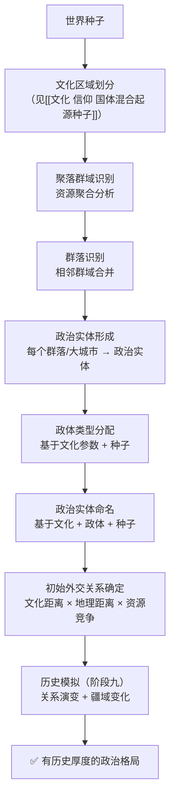

# 聚落群域与政治实体

> **更新 2026-06-02**：大幅扩展——从简单的聚落群域概念到完整的政治实体设计

---

## 一、聚落群域（Settlement Cluster）

### 1.1 定义

一定范围内的一大片区域集齐了能够生成[[聚落]]四级类型（城市、城堡、小镇、村庄）的所有资源时，将这一大片区域作为一个整体，称为**聚落群域**。

在聚落群域中，根据[[聚落生成地貌资源判断]]来具体决定每个[[聚落]]的选址。

### 1.2 聚落群域的规模

| 规模等级 | 聚落数量 | 典型构成 | 覆盖面积 |
|----------|---------|---------|---------|
| 小型群域 | 3-8 个 | 1城市 + 0-1城堡 + 1-2小镇 + 若干村庄 | ~5-15 km² |
| 中型群域 | 8-20 个 | 2-3城市 + 1-2城堡 + 2-5小镇 + 若干村庄 | ~15-50 km² |
| 大型群域 | 20-50 个 | 4-8城市 + 2-4城堡 + 5-15小镇 + 大量村庄 | ~50-200 km² |

一个聚落群域至少需要有两个城市（以保证一定的复杂度和政治实体形成的基础）。

---

## 二、群落（Cluster Confederation）

### 2.1 定义

数个地理位置相邻的[[聚落群域]]，因地理邻近、贸易往来、文化同源或政治联盟而组成一个更大的地理-政治单元，称为**群落**。

群落是比聚落群域更高一级的概念。如果说聚落群域是"一个区域内的所有聚落"，群落则是"数个区域之间的松散联合"。

### 2.2 群落的形成条件

- 相邻聚落群域之间距离 ≤ 30km
- 存在至少一条可通行的道路连接
- 共享至少一种文化元素（语言、宗教、建筑风格等）
- 经济上有互补或竞争关系

### 2.3 群落的层级关系

```
群落（Cluster Confederation）
  ├─ 聚落群域 A（Settlement Cluster）
  │   ├─ 城市 A1
  │   ├─ 城堡 A2
  │   ├─ 小镇 A3、A4
  │   └─ 村庄 A5-A10
  ├─ 聚落群域 B
  │   ├─ 城市 B1、B2
  │   ├─ 城堡 B3
  │   └─ 小镇 B4-B6 + 村庄 B7-B15
  └─ 聚落群域 C ...
```

---

## 三、政治实体（Polity）

### 3.1 核心概念

一个聚落群域、数个聚落群域组成的群落，或单个大城市，能够构成一个**政治实体**。

政治实体 = 一个有独立或半独立政治意志的地理-社会组织。它有自己的：
- **名称**
- **政体（政府形式）**
- **领土范围**（一个或多个聚落群域）
- **统治机构**（个人/寡头/议会/……）
- **对外关系**（与其他政治实体的外交状态）

### 3.2 政治实体的可能名称

政治实体的命名向现实和历史借鉴，支持以下类别：

| 类别 | 名称示例 | 典型特征 |
|------|---------|---------|
| **王国类** | 王国、帝国、公国、大公国、侯国、伯国 | 君主制，层级分明的贵族体系 |
| **共和国类** | 共和国、联邦、邦联、自由邦 | 非君主制，公民/贵族议事机构 |
| **城邦类** | 城邦、自由城、商业共和国 | 以单个城市为核心，辐射周边 |
| **部落类** | 部落联盟、大汗国、酋邦、氏族领地 | 血缘或军事领袖为核心 |
| **宗教类** | 教宗国、骑士团国、神权国、修道院联盟 | 宗教领袖兼任政治领袖 |
| **契约类** | 同盟、贸易联盟、佣兵自由领、冒险者共治领 | 基于共同利益或契约的非传统政体 |
| **特殊类** | 龙巢领地、魔法议会辖地、亡灵领 | 奇幻世界特有的政治实体形式 |

### 3.3 政体类型（Government Forms）

一个政治实体的统治方式从以下维度决定：

#### 统治权力来源

| 权力来源 | 说明 | 示例 |
|----------|------|------|
| **世袭** | 权力在家族内传承 | 王国、公国、帝国 |
| **选举** | 由特定人群投票产生统治者 | 共和国、商业联盟 |
| **神授** | 宣称权力来自神明 | 教宗国、神权国 |
| **武力** | 靠军事力量夺取和维持 | 军阀割据、征服者帝国 |
| **贤能** | 由被认为最有能力者统治 | 贤者议会、魔法议会 |
| **契约** | 基于共同签署的协议 | 贸易联盟、佣兵自由领 |
| **血统/种族** | 统治权绑定于特定种族或血脉 | 精灵王庭、龙主领地 |

#### 统治结构

| 结构 | 说明 | 决策效率 | 稳定性 |
|------|------|---------|--------|
| **绝对君主制** | 一人独裁 | 极高 | 取决于君主个人能力 |
| **立宪君主制** | 君主+议会/贵族院 | 中 | 较高 |
| **寡头制** | 少数精英（贵族/富豪）统治 | 中-高 | 中 |
| **民主共和制** | 公民投票决定（世界观下可能是有限公民权） | 低 | 高 |
| **神权制** | 宗教领袖/祭司阶级统治 | 中 | 高（信仰统一时） |
| **军事独裁** | 军队统帅统治 | 高 | 低（继承危机频发） |
| **无政府/自治** | 无中央统治机构，聚落各自为政 | — | 低（外部威胁下脆弱） |
| **议会共治** | 多派系代表组成议会 | 低-中 | 中（取决于派系合作程度） |
| **长老会** | 年长智者集体决策 | 低 | 高（传统社会） |

### 3.4 政治实体的规模

| 规模 | 领土 | 典型政体 |
|------|------|---------|
| **城邦级** | 1个城市 + 周边村庄 | 城邦、自由城、商业共和国 |
| **地区级** | 1个完整聚落群域 | 公国、伯国、部落联盟 |
| **王国级** | 2-5个聚落群域（群落） | 王国、共和国、教宗国 |
| **帝国级** | 5+聚落群域，可能跨不同文化区 | 帝国、大汗国、大联邦 |

---

## 四、政治实体内部：聚落间关系

一个政治实体由多个聚落组成，聚落之间存在多种关系类型：

### 4.1 政治从属关系

| 关系类型 | 说明 | 示例 |
|----------|------|------|
| **直属统治** | 聚落直接受政治实体的中央机构管辖 | 王都直接管辖的城镇 |
| **封建从属** | 聚落由受封的领主统治，领主向更高层效忠 | 公爵领 → 伯爵领 → 男爵领 |
| **自治附庸** | 聚落有内部自治权，但在外交/军事上从属于政治实体 | 自治市、特许城 |
| **总督/行省** | 聚落由中央派遣的官员管理，定期轮换 | 帝国的行省城市 |

### 4.2 经济关系

| 关系类型 | 说明 |
|----------|------|
| **粮食供给** | 村庄 → 城镇：基础食物和原材料单向输送 |
| **加工贸易** | 城镇 → 城市：精加工商品向上流动 |
| **相互依赖** | 两个聚落各自产出对方所需的核心物资 |
| **单方面供养** | 一个聚落（通常是城堡或要塞）完全依赖其他聚落供养 |
| **竞争关系** | 两个同等级聚落争夺同一市场或资源 |
| **专营关系** | 某聚落垄断了区域内某种关键商品的生产 |

### 4.3 社会/文化关系

| 关系类型 | 说明 |
|----------|------|
| **母城-子城** | 一个城市殖民或扩张出新的聚落，文化高度一致 |
| **姻亲联盟** | 两个聚落的统治家族通过婚姻绑定 |
| **宗教中心-属地** | 聚落A是宗教圣地，其他聚落定期朝圣/进贡 |
| **文化同源** | 共享语言、习俗、建筑风格 |
| **文化分歧** | 原本同源但因隔离而产生文化差异（方言、习俗变异） |
| **敌对/世仇** | 历史上发生过战争或背叛，关系恶劣 |

### 4.4 关系动态

聚落间关系不是静态的——它随游戏进程变化：

- **深度合作**：共同防御、共享资源、跨国贸易
- **激烈冲突**：领土争端、贸易战、宗教冲突、家族复仇
- **渐行渐远**：因道路荒废、资源枯竭、人口迁徙而关系淡化
- **兼并/吞并**：一个聚落被另一个政治实体吞并

---

## 五、政治实体之间：外部关系

### 5.1 存档创建之初的政治实体关系呈现

世界生成时，政治实体之间的关系从以下因素派生：

```
世界种子 → 文化种子 → 政治实体文化参数
                         ↓
          两个政治实体之间的文化距离
          × 地理距离
          × 资源竞争程度
          × 历史模拟结果（阶段九）
                         ↓
          初始外交状态
```

#### 初始外交状态种类

| 状态 | 表现 | 触发条件 |
|------|------|---------|
| **同盟** | 共同防御、贸易优惠、军事通行权 | 文化相近 + 面临共同威胁 |
| **友好** | 正常贸易、人员往来 | 文化相近或互不竞争 |
| **中立** | 有限互动、视对方为"存在" | 默认状态 |
| **冷淡** | 贸易受限、外交礼仪勉强维持 | 文化差异大或轻微利益冲突 |
| **敌对** | 边境封锁、军事对峙 | 资源激烈竞争或历史仇怨 |
| **战争** | 主动军事冲突（较少作为初始状态） | 历史模拟中触发 |

### 5.2 政治实体间互动类型

| 互动维度 | 具体行为 |
|----------|---------|
| **外交** | 派遣使节、缔结条约、王室联姻、宣战/议和 |
| **贸易** | 商路开辟、关税政策、贸易禁运、走私 |
| **军事** | 边境冲突、联盟作战、代理人战争、全面入侵 |
| **文化** | 文化渗透、宗教传播、语言同化、艺术交流 |
| **情报** | 间谍渗透、情报买卖、谣言传播 |

### 5.3 政治实体的疆域变化

政治实体的疆域不是固定的：
- **扩张**：征服、殖民、联姻继承
- **收缩**：战败割地、内部叛乱、聚落衰亡
- **分裂**：继承纠纷、内战、文化离心力
- **合并**：联姻统一、被征服整合、自愿联盟

---

## 六、世界生成中的政治实体初始化

### 6.1 生成流程



### 6.2 政治实体数量预估

| 世界规模 | 聚落群域数量（预估） | 政治实体数量（预估） |
|----------|---------------------|---------------------|
| 4km × 4km（初始） | 2-5 个 | 2-8 个 |
| 16km × 16km（最大） | 10-30 个 | 10-50 个 |

### 6.3 命名规则

政治实体名称由以下要素组合（示例）：

```
[政体前缀] + [文化/地名] + [政体后缀]

示例：
  - 艾尔尼亚王国
  - 北境诸部落联盟
  - 银沙商业共和国
  - 圣光教宗国
  - 龙脊山矮人伯国
  - 幽暗森林自由领
```

命名由文化种子和世界种子共同决定，保证同一种子下名称唯一且一致。

---

## 七、与 NPC 系统的整合

### 7.1 NPC 对政治实体的认知

- NPC 知道自己所属的政治实体
- NPC 对政治实体的态度受个人经历影响（战争幸存者 vs 和平居民）
- NPC 对统治者有态度——爱戴、恐惧、冷漠、蔑视
- 政治实体的政策变化可能影响 NPC 的日常行为（征兵、加税、开战）

### 7.2 著名度系统与政治实体

政治实体的重大事件进入[[世界记录]]系统：
- "艾尔尼亚王国向北方部落宣战"
- "银沙共和国选出了新执政官"
- "龙脊山的矮人发现了秘银大矿脉"

这些事件成为整个世界的共享记忆，影响跨政治实体的外交和NPC行为。

---

## 八、关联文档

| 文档 | 关联内容 |
|------|---------|
| [[聚落]] | 四级聚落体系 |
| [[聚落生成地貌资源判断]] | 聚落选址的资源判断 |
| [[聚落改变规则0.5]] | 聚落随时间变化的规则 |
| [[02-聚落生成规则]] | 聚落生成的完整规则 |
| [[文化 信仰 国体混合起源种子]] | 文化、信仰、政体的起源种子 |
| [[总设计草稿]] | §7 经济与社会 |
| [[世界记录]] | 著名度/历史事件记录 |
| [[道德]] | 道德共识与法律体系 |
| [[经济]] | 动态经济系统 |
