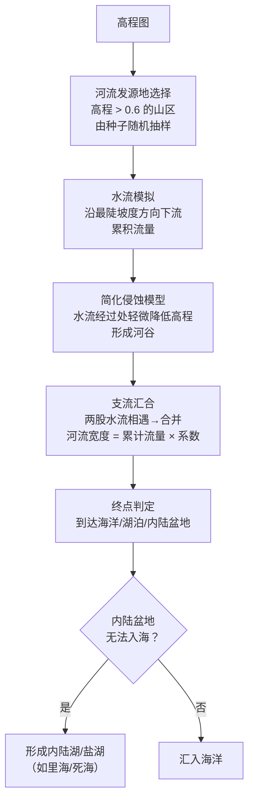
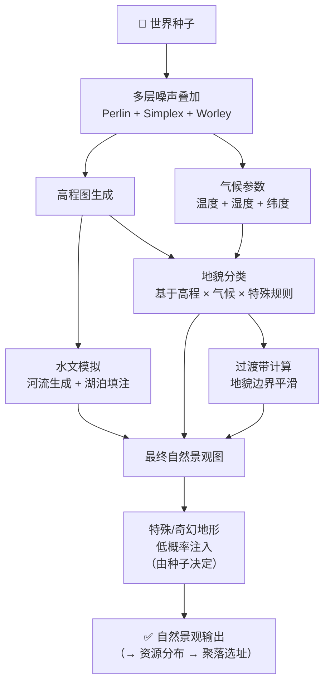

# 自然景观设计

> **更新 2026-06-02**：大幅扩展——从简单类型列表到完整的自然景观体系，新增河流高程系统、幻想地形设计

---

## 一、描述

自然景观是由丰富的地貌构成的，既有现实中存在的地貌，也有存在于幻想世界之中的地貌；大多数地貌，相较于市面上的其他游戏如 Minecraft，从每个地貌（Minecraft 中叫生物群系）的面积上来看，都颇具规模、一望无际。

当一个地貌满足某种条件，有概率生成[[人文景观]]（[[聚落]]等）。

世界是基于一个初始数字（种子），通过多层噪声函数的叠加计算，最终"绘制"出千变万化的地貌的。详见[[自然景观分布规划]]和[[各地貌资源规划]]。

---

## 二、自然景观类型

### 2.1 山地系统

| 类型 | 海拔 | 特征 | 植被 | 典型资源 |
|------|------|------|------|---------|
| **丘陵** | 100-500m | 起伏和缓，坡度较缓，连绵不断 | 草地、灌木、稀疏林地 | 粘土、碎石、小型采石场 |
| **低山** | 500-1500m | 有明显山形，坡度中等，山谷分明 | 混合林地 | 石材、煤矿、铁矿 |
| **高山** | 1500-3000m | 陡峭山脊，深谷，岩石裸露 | 针叶林→高山灌丛→苔藓（随海拔递减） | 花岗岩、铁矿、水晶 |
| **雪山** | 3000m+ | 终年积雪，冰川，悬崖峭壁 | 极少（苔藓、地衣） | 冰、雪、秘银（深层） |
| **火山** | 不定 | 锥形山体，火山口，熔岩流遗迹 | 火山坡：特殊耐热植被 | 玄武岩、黑曜石、硫磺、魔法水晶 |
| **台地/方山** | 500-2000m | 顶部平坦开阔，边缘陡峭（悬崖） | 顶部：草原/森林；崖壁：裸露 | 沙岩、石灰岩（层状分布） |

### 2.2 高原系统

| 类型 | 海拔 | 特征 | 植被 | 典型资源 |
|------|------|------|------|---------|
| **草原高原** | 1000-3000m | 广阔平坦或微波状，天空近 | 高草草原，树木稀少 | 草场（畜牧）、粘土 |
| **荒漠高原** | 1500-4000m | 干旱，昼夜温差极大，岩石裸露 | 极稀疏（旱生灌丛） | 盐、沙岩、特殊矿石 |
| **熔岩高原** | 不定 | 远古火山喷发形成的广阔玄武岩台地 | 特殊适应植被 | 玄武岩、黑曜石 |

### 2.3 平原系统

| 类型 | 海拔 | 特征 | 植被 | 典型资源 |
|------|------|------|------|---------|
| **冲积平原** | <200m | 河流冲积形成的平坦沃土，水网密布 | 农田（游戏内最高农业产出） | 粘土、沙、肥沃土壤 |
| **草原** | 200-800m | 广阔草地，偶有起伏 | 高草/矮草草原，树木极少 | 草场（畜牧）、粘土 |
| **稀树草原** | 200-1000m | 草原上散布孤树和小树林 | 草地 + 稀疏乔木（如金合欢） | 草场、硬木 |
| **花海** | 200-800m | 特殊的草原变体，花卉极密集 | 花海（季节变化） | 染料植物、蜂蜜、药草 |
| **冰原/冻土** | 不定（高纬） | 地下有永冻层，地表夏季表层融化 | 苔藓、地衣、矮灌丛 | 冰、雪、泥炭 |

### 2.4 森林系统

| 类型 | 特征 | 植被 | 典型资源 |
|------|------|------|---------|
| **温带阔叶林** | 四季分明，落叶阔叶树为主 | 橡树、榉木、枫树、桦树 | 硬木、坚果、蘑菇、猎物 |
| **温带针叶林（泰加林）** | 寒冷，常绿针叶树 | 云杉、冷杉、松树 | 软木、松脂、皮毛动物 |
| **热带雨林** | 炎热潮湿，物种极丰富 | 多层冠层，藤蔓密布 | 热带硬木、香料、稀有药草 |
| **温带雨林** | 温和多雨，苔藓覆满 | 巨杉、铁杉、蕨类 | 巨木、苔藓、特殊蘑菇 |
| **沼泽森林** | 常年或季节性积水 | 耐水树种（落羽杉等），水生植物 | 泥炭、粘土、特殊药草 |
| **魔法森林** | 受魔法影响的特殊森林 | 发光植物、巨型蘑菇、水晶树 | 魔法水晶、魔力药草、菌丝土 |

### 2.5 水域系统

| 类型 | 特征 | 生态 |
|------|------|------|
| **海洋** | 大面积咸水，深浅变化，洋流系统 | 鱼类、珊瑚礁（浅海）、深海资源 |
| **大型湖泊** | 内陆大面积淡水，深度变化 | 淡水鱼、水生植物、粘土层 |
| **小型湖泊/池塘** | 局部积水，通常有溪流连通 | 淡水鱼、水生植物 |
| **河流** | 从高海拔流向低海拔，最终汇入海洋（见 §三 河流系统） | 淡水鱼、河岸植被、沙金 |
| **溪流/山涧** | 山区小型水流，河流的上游形态 | 小型水生生物 |
| **沼泽** | 浅水覆盖的平坦区域，水生植物茂密 | 泥炭、药草、水鸟 |
| **湿地** | 季节性淹水，生物多样性极高 | 水鸟、鱼类、特殊植物 |
| **盐碱地/盐沼** | 高盐度土壤，仅特定植物能生存 | 盐、特殊矿物 |
| **温泉/间歇泉** | 地热加热的水体 | 特殊矿物质、地热资源 |

### 2.6 干旱系统

| 类型 | 特征 | 植被 | 典型资源 |
|------|------|------|---------|
| **沙质沙漠** | 连绵沙丘，极度干旱 | 极稀疏（绿洲附近有植被） | 沙、沙岩、稀有沙漠矿物 |
| **戈壁/砾漠** | 碎石覆盖，几乎无沙 | 极少 | 特殊石材、陨石碎片 |
| **岩漠** | 裸露基岩，风蚀地貌 | 极少 | 各种石材 |
| **半干旱灌木地** | 介于沙漠和草原之间的过渡带 | 耐旱灌丛、仙人掌类 | 硬纤维植物、特殊药草 |
| **绿洲** | 沙漠中有水源的小区域 | 棕榈树、果树、农作物 | 淡水（沙漠中最宝贵的资源） |

### 2.7 海岸系统

| 类型 | 特征 |
|------|------|
| **沙滩** | 细沙覆盖的海岸线 |
| **岩岸/悬崖海岸** | 岩石海岸，海浪侵蚀形成悬崖和海蚀洞 |
| **珊瑚礁潟湖** | 浅水、珊瑚礁环绕的宁静水域 |
| **红树林海岸** | 热带/亚热带的耐盐树木生长在潮间带 |
| **峡湾** | 冰川侵蚀形成的深窄海湾，两岸陡峭 |

### 2.8 特殊/奇幻地形

> ⚠️ **本节为剑与魔法世界观特有的地形**。这些地形需要在自然景观分布规划中为之预留生成空间（低概率出现，作为世界中的"奇观"或"特殊区域"）。

| 类型 | 特征 | 生成条件 | 世界观解释 |
|------|------|---------|-----------|
| **空岛/浮空岛** | 悬浮于空中的岛屿，大小不等 | 极低概率（<2%），往往成群出现 | 古代魔法战争的遗迹，或世界诞生之初的元素失衡 |
| **魔化地** | 地面被魔法能量浸染，呈现异常颜色和形态 | 魔法森林深处 或 古战场遗址 | 大量魔法能量的释放永久改变了土地性质 |
| **水晶地貌** | 地表生长出巨大的天然水晶柱/簇 | 极低概率，地下有魔法水晶矿脉时地表可能呈现 | 魔力在地壳中的自然结晶 |
| **深渊裂隙** | 地面裂开深不见底的裂缝，宽度可达数十米 | 低概率，常伴随地震带 | 地下世界/远古文明的入口，或世界骨骼的断裂 |
| **石化森林** | 树木全部石化的森林遗迹 | 低概率出现在沙漠/半干旱区 | 远古森林被瞬间掩埋后矿化 |
| **龙陨之地** | 远古巨龙死亡之处，地形被龙血/龙息改变 | 极低概率（0.5-1%） | 龙血改变了土壤，形成特殊的生态微环境 |
| **元素倾泻区** | 单一元素极度富集的区域（永燃之地/永冻区/雷暴平原） | 低概率 | 元素位面与主世界在此处有裂隙 |
| **巨人遗迹** | 超大规模的石柱/石环/雕刻地貌 | 极低概率 | 先于当前文明的未知种族遗留 |
| **菌菇森林** | 巨型真菌构成的"森林"，昏暗奇幻 | 洞穴深处或特定魔法群系 | 地下魔法能量催生的巨型真菌生态 |
| **彩虹谷/极光原野** | 天空或地面呈现持续的特殊光学现象 | 极低概率，魔力浓度极高的区域 | 魔法能量与自然光的相互作用 |

### 2.9 地形过渡带

不同地貌之间不是突然切换的——存在渐变过渡：

| 过渡类型 | 宽度 | 特征 |
|----------|------|------|
| 森林→草原 | 100-500m | 树木逐渐稀疏，林间空地增多 |
| 草原→沙漠 | 200-800m | 草地→半干旱灌木地→荒漠 |
| 山地→平原 | 200-1000m | 山麓冲积扇→缓坡→平地 |
| 河流沿岸 | 10-200m | 河岸植被带逐渐过渡到周边地貌 |

---

## 三、河流系统

### 3.1 核心原则：水往低处流

河流必须遵循重力原则——从高海拔发源，沿地形坡度向下流动，支流汇入干流，干流汇入湖泊或最终进入海洋。

### 3.2 河流生成算法

### 3.3 河流分级

采用斯特拉勒（Strahler）河流分级法（简化版）：

| 级别 | 描述 | 宽度 | 深度 | 流速 | 可航行 |
|------|------|------|------|------|--------|
| **1级** | 山涧溪流，无支流 | 0.5-2m | 0.1-0.5m | 快 | ❌ |
| **2级** | 小型河流，1-2条支流汇入 | 2-8m | 0.5-1.5m | 中-快 | 小型船 |
| **3级** | 中型河流，3-5条支流 | 8-30m | 1-3m | 中 | ✅ 中型船 |
| **4级** | 大型河流/干流 | 30-100m | 2-8m | 缓 | ✅ 大型船 |
| **5级** | 巨川（入海口附近） | 100-500m+ | 5-20m | 极缓 | ✅ 海船可入 |

### 3.4 河流与游戏性

- **河流作为天然边界**：大型河流常成为政治实体之间的天然国境线
- **河流作为交通要道**：3级及以上河流可航行，是重要的贸易路线
- **河流渡口**：道路与河流交叉处自然形成渡口/桥梁，渡口附近常形成聚落
- **水力资源**：河流旁可建设水磨坊，落差大的河段可用于水力驱动的工业（铁匠铺等）
- **河流改道**：极端事件（地震、大型魔法）可能导致河流改道，产生深远的社会影响

### 3.5 特殊水体

| 类型 | 特征 |
|------|------|
| **瀑布** | 河流经过陡崖处，高度从数米到数百米不等 |
| **峡谷/峡谷河** | 河流深切岩层形成幽深峡谷（如科罗拉多大峡谷） |
| **地下河** | 河流进入洞穴系统，在地下流动一段距离后重新流出 |
| **温泉河** | 地热加热的河流，在冬季不结冰 |
| **间歇河** | 仅在雨季有水的季节性河流 |

---

## 四、幻想世界观下的自然景观展望

当前的自然景观设计仍然以现实地理为基础。为了贴合**剑与魔法的奇幻世界**，未来需要在以下方向探索：

### 4.1 魔法对地形的长期影响

- 魔法能量富集区域的地表会逐渐"魔法化"——岩石可能浮空、植被发光、水流逆重力
- 大规模古代魔法战争留下的永久性地形伤疤（如焦痕荒原、元素倾泻区）
- 神明的直接干预可能创造无法用自然规律解释的地形（如完美的圆形内海、悬浮山脉）

### 4.2 非碳基生态的可能性

- 硅基植物：水晶森林中的"树"本质上是缓慢生长的矿物晶体
- 魔法能量为食的生态链：不依赖阳光，以魔力浓度为能量金字塔基础
- 元素生物塑造的地貌：火元素聚居区可能呈现火山地貌，水元素聚居区可能改变水文

### 4.3 动态地形

- 某些区域的地形可能不是静态的——浮空岛缓慢漂移、魔法森林"生长"和"收缩"
- 季节性地形变化：冰封的河流冬季可通过、春季融化后恢复
- 事件驱动的地形变化：地震、火山喷发、魔法灾难可能实时改变地形

### 4.4 未来设计方向（非现阶段实现）

这些概念在当前开发阶段暂不作为实现目标，但在设计其他系统时应预留接口：

- 位面重叠区：主世界与其他位面（元素位面、灵界）在此处重叠，地貌同时呈现两个世界的特征
- 活的景观：某些区域的地形本身就是巨型生物（如沉睡的巨兽龟、世界蛇）
- 时间异常区：区域内的地形呈现出不同时代的特征（如一片区域内同时有远古蕨类森林和中世纪建筑遗迹）

---

## 五、生成流程概要

---

## 六、关联文档

| 文档 | 关联内容 |
|------|---------|
| [[自然景观分布规划]] | 跨区块自然景观的密度控制和分布规划 |
| [[各地貌资源规划]] | 每种地貌中的资源填充 |
| [[资源类型]] | 自然资源的分类体系 |
| [[01-世界生成总流程]] | 世界生成管线的完整流程 |
| [[总设计草稿]] | §3 世界系统 |
| [[世界]] | 世界生成内容总览 |
| [[聚落生成地貌资源判断]] | 地貌资源如何影响聚落选址 |
